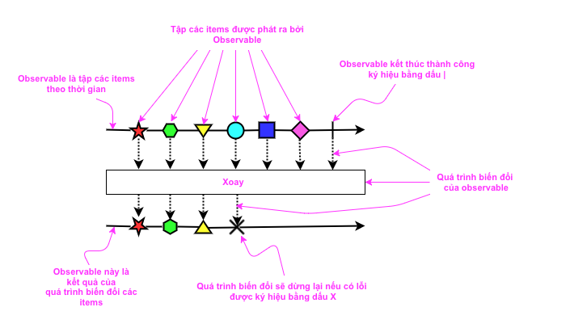
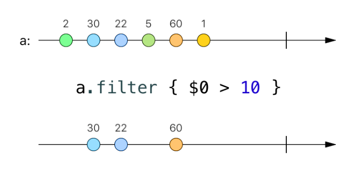
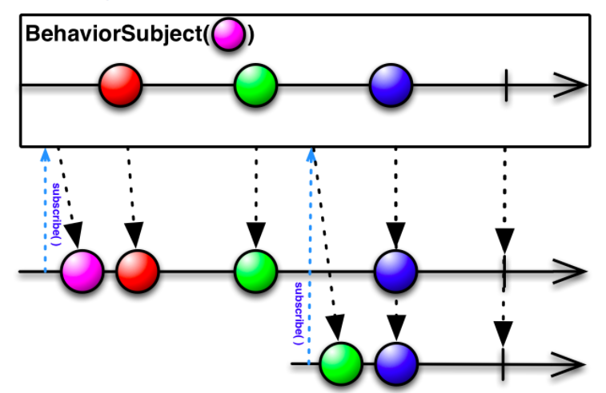
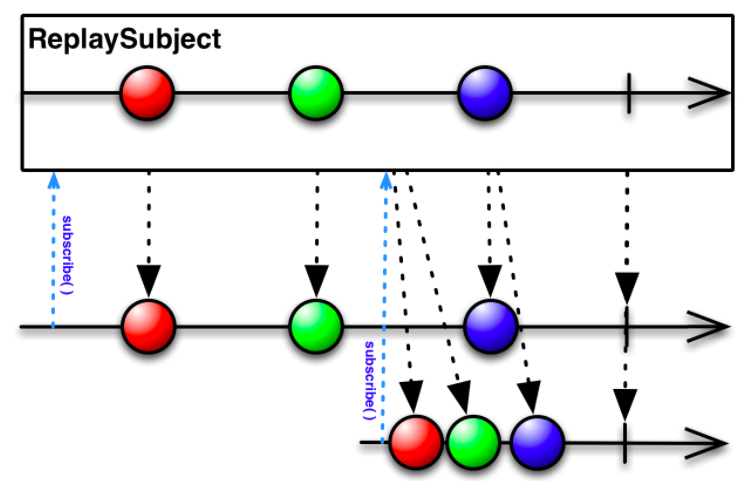

**Reactive Programming with Swift**

> Mọi chia sẻ hay sao chép phải được cấp phép, tác quyền thuộc team iOS - Asian Tech, Inc

# Contents

1. [Get Started](#get-started)
  1. [Reactive](#Reactive)
  2. [Observable và Observer](#Observable-Observer)
  3. [Operator - man in the middle](#Operator-man-in-the-middle)
  4. [Subjects](#Subjects)

2. [Deep Dive](docs/Deep-dive)
	1. [Creation](docs/Deep-dive/Creation.md)
	2. [Operators](docs/Deep-dive/Operators)
	3. [MVVM](docs/Deep-dive/MVVM.md)

3. Advanced(Update later)

4. [Testing](docs/Testing.md)
	1. [RxTests](#RxTests)
	2. [RxNimble](#RxNimble)(Update later)

## 1. Getting Started <a name="get-started"></a>
### 1.1. Reactive <a name="Reactive"></a>

**Reactive programming là gì?**

 -  **Reactive programming is programming with asynchronous data streams.**

    **Reactive programming** là phương pháp lập trình với **luồng dữ liệu bất đồng bộ** hay **những thay đổi có tính lan truyền** (the propagation of change). Khái niệm **luồng** (stream) rất phổ biến, bạn có thể tạo một luồng từ bất kì kiểu dữ liệu nào: các biến (variables), giá trị đầu vào từ người dùng (user inputs), properties, caches, data structures, etc. Có thể nói luồng là trung tâm của **reactive**.

- Một luồng là một dãy(sequence) các sự kiện đang diễn ra được sắp xếp theo thời gian. Nó có thể phát ra 3 thứ: một **value**, một **error**, hoặc một **completed**. 

- Để minh họa cho luồng người ta hay dùng một loại biểu đồ gọi là [marble diagram](http://rxmarbles.com/), loại diagram này rất đơn giản, trực quan và dễ hiểu. Mô hình dưới đây là luồng sự kiện "click vào 1 button"


- Ở đây tín hiệu giúp ta biết được khi nào luồng sự kiện click **completed** là khi window hoặc view chứa button bị đóng lại.
- Chúng ta bắt các sự kiện **bất đồng bộ** (ví dụ như tap vào button, gọi API, ...) bằng cách define một function dùng để xử lý một giá trị được phát ra, một function khác để handle error, tương tự với completed. Các function chúng ta define là các **observer**, luồng là chủ thể đang được lắng nghe hay còn gọi là **Observable**. Ví dụ sử dụng mã ASCII để minh hoạ:

```groovy
--a---b-c---d---X---|->

a, b, c, d là các giá trị được phát ra
X là một 'error' nào đó
| là một signal 'completed'
```
> Ta có thể xem đây là một stream

### 1.2. Observable và Observer <a name="Observable-Observer"></a>

#### 1.2.1 Mở đầu

- Có rất nhiều thuật ngữ dùng để mô tả và thiết kế của lập trình bất đồng bộ. Trong tài liệu này sẽ chỉ sử dụng thuật ngữ **Observer** và **Observable**.

#### 1.2.2 Observer và Observable là gì?

- **Observer** lắng nghe **Observable**.
- **Observable** phát ra các items hoặc gửi các notifications đến các **Observer** bằng cách gọi các **Observer** methods.

> Khái niệm Observable đến từ observer design pattern là một đối tượng thông báo cho các đối tượng theo dõi về một điều gì đó đang diễn ra. [source](https://xgrommx.github.io/rx-book/content/observable/index.html#)

- Diagram dưới đây biểu diễn **Observable** và quá trình biến đổi của nó:



- Một **Observer** đăng ký lắng nghe một **Observable**, sau đó nó sẽ xử lý một item hoặc nhiều các item mà **Observable** phát ra. 

#### 1.2.2 Khởi tạo Observable và Observer

- Về cơ bản flow của việc khởi tạo đều trải qua các bước sau:
	- Khai báo một method có giá trị được trả về từ một hàm gọi bất đồng bộ, method này là một phần của **Observer**.
	- Khai báo một **Observable**.
	- Đăng kí **Observer** vào **Observable**.
	- Method của **Observer** sẽ bắt đầu xử lý các business logic dựa trên giá trị trả về hoặc các giá trị được phát ra bởi **Observerble**.

  ```groovy
  // Khai báo một observer
  def myOnNext = { value -> xử lý các business logic với value }
  // Khai báo một Observable
  def myObservable = someObservable(itsParameters);
  // Đăng ký observer vào observable
  myObservable.subscribe(myOnNext);
  ```

- **onNext, onCompleted, và onErrror**

  ​	**[Subscribe method](http://reactivex.io/documentation/operators/subscribe.html)** là cách kết nối **Observer** với **Observable**. Observer's implementation gồm các method:

  **onNext**: **Observable** gọi hàm **onNext** có tham số là item, item này là một trong các tập items của **Observable**

  **onError**: Được gọi khi **Observable** kết thúc với một lỗi xảy ra trong quá trình chuyển đổi, xử lý dữ liệu.

  **onCompleted**: **Observable** gọi hàm này sau khi hàm **onNext** cuối cùng được gọi, nếu không có bất kì lỗi nào xảy ra.

  **Ví dụ bằng code swift:**

  ```swift
  let obj = Observable.from(["🐶", "🐱", "🐭", "🐹"]) // Khởi tạo một Observable
  obj.subscribe( // Thực hiện subscribe Observable
    onNext: { data in
      print(data) // Nơi nhận dữ liệu của Observer được gửi đi từ Observable
    }, 
    onError: { error in
      print(error) // Nơi nhận error và Observable được giải phóng
    }, 
    onCompleted: {
      print("Completed") // Nhận được sự kiện khi Observable hoàn thành và Observable được giải phóng
    })
     .disposed()
  ```

  ```swift
  🐶
  🐱
  🐭
  🐹
  Completed
  ```

  **iOS**

  ```swift
  @IBOutlet weak var textField: UITextField!

  override func viewDidLoad() {
    super.viewDidLoad()
    let observable = textField.rx.text.orEmpty // Khởi tạo observable
    observable.subscribe(onNext: { (text) in 
    // Mỗi lần thay đổi text trong textField, Observer sẽ nhận được giá trị text mới của textField.
      print(text)
    })
  }
  ```

  ​

- **"Hot" và "Cold" Observable**

  Khi nào **Observable** phát ra chuỗi các items? Điều đó phụ thuộc vào **Observable**. Một **"Hot Observable"** có thể bắt đầu phát các items ngay khi nó được tạo ra, và sau đó bất kỳ **Observer** nào đăng ký tới **Observable** đều có thể bắt đầu quan sát(observing) từ khoảng giữa của tiến trình. Trái lại, **"Cold Observable"** thì chờ cho đến khi một **Observer** nào đó đăng kí vào **Observable** trước khi nó bắt đầu phát ra các items, và do đó **Observer** có thể đảm bảo được việc quan sát từ toàn bộ tiến trình từ lúc bắt đầu ( to see the whole sequence from the beginning.) [Chi tiết](http://reactivex.io/documentation/observable.html)


### 1.3. Operator - man in the middle <a name="Operator-man-in-the-middle"></a>
Operators là những phép toán cho phép biển đổi observable thành observable mới để phù hợp với nhu cầu sử dụng

Một số operators cơ bản trong RxSwift được liệt kê [tại đây](docs/deep-dive/operators)

**Example 1:**



```swift
let observable = Observable.of(2,30,22,5,60,1) // 1
let newObservable = observable.filter { $0 > 10 } // 2
```
**OUTPUT: 30 22 60**

1. Khởi tạo observable các số nguyên --2--30--22--5--60--1
2. Qua phép filter với điều kiện ($0 > 10). Chúng ta đã có được một observable mới là --30--22--60


**Example 2:**
	Ở ví dụ này chúng ta sử dụng phép filter vào việc tìm kiếm bằng UISearchBar control

```swift	
let observable = searchBar.rx.text.orEmpty.asObservable() // 1   

observable.filter { $0.hasPrefix("Number") } // 2
.subscribe(onNext: { (text) in // 3
	// Do something when emit events
})
.disposed(by: disposeBag) // dispose it on deinit.
```
1. Khởi tạo observable thể hiện cho sự thay đổi nội dung của search bar
2. Lọc nội dụng bắt đầu bằng chuỗi `Number`
3. Subcrible một observable để có thể xử lý mỗi khi nội dung search bar thay đổi

### 1.4. Subjects <a name="Subjects"></a>

> Một đối tượng vừa có thể là Observable vừa có thể là Observer được gọi là Subject.

​Chẳng hạn khi sử dụng UIImagePickerController, ngoài việc quan tâm tới việc load hình ảnh từ Photos Library (lúc này UIImagePickerController là Observer) thì ứng dụng cần tương tác với chính UIImagePickerController để ẩn, hiển, chọn ảnh… (lúc này UIImagePickerController là Observable). Vậy ta có thể hiểu UIImagePickerController là một Subject
​
#### 1.4.1. PublishSubject

​	PublishSubject là các phần tử có thể được phát ngay sau khi Subject được khởi tạo, bất chấp chưa có đối tượng nào subscribe tới nó (hot observable). Observer sẽ không nhận được các phần tử phát ra trước thời điểm subscribe.


```swift
// Khởi tạo đối tượng PublishSubject.
let subject = PublishSubject<String>()

// subject phát đi event.
subject.onNext("Is anyone listening?")

// subscriptionOne đăng ký lắng nge đối tượng subject trên.
let subscriptionOne = subject.subscribe(onNext: { string in
	print("1)", string)
})

subject.onNext("1")
subject.onNext("2")

// subscriptionTwo đăng ký lắng nge đối tượng subject trên.
let subscriptionTwo = subject.subscribe { event in
	print("2)", event.element ?? event)
}

subject.onNext("3")

// deinit subscriptionOne
subscriptionOne.dispose()

subject.onNext("4")

// deinit subscriptionTwo
subscriptionTwo.dispose()
```

```swift
// Ouput:
1) 1
1) 2
1) 3
2) 3
2) 4
```

#### 1.4.2. BehaviorSubject

​	BehaviorSubject có cơ chế hoạt động gần giống với PublishSubject, nhưng Observer sẽ nhận được giá trị mặc định hoặc giá trị ngay trước thời điểm subscribe. Observer sẽ nhận được ít nhất một giá trị.

​	Chẳng hạn, nếu coi việc cuộn thanh trượt của UIScrollView là một observable (offset là giá trị của các phần tử trong stream), thì ngay khi subscribe vào observable, chúng ta cần biết vị trí offset hiện tại của UIScrollView, do vậy chúng ta cần sử dụng BehaviorSubject

#### 

```swift
let disposeBag = DisposeBag()

// Khởi tạo đối tượng BehaviorSubject.
let subject = BehaviorSubject(value: "Initial value")

// subject phát đi event.
subject.onNext("1")

// Đăng ký lắng nge đối tượng subject trên.
subject.subscribe {
		print("1)", $0)
	}
	.disposed(by: disposeBag)

subject.onNext("2")

// Đăng ký lắng nge đối tượng subject trên.
subject.subscribe {
		print("2)", $0)
	}
	.disposed(by: disposeBag)

subject.onNext("3")
```

```swift
// Output:
1) 1
1) 2
2) 2
1) 3
2) 3
```

#### 1.4.3. ReplaySubject

​	ReplaySubject tương tự như BehaviorSubject nhưng thay vì phát thêm duy nhất một phần tử trước đó, ReplaySubject cho phép ta chỉ định số lượng phần tử tối đa được phát lại khi subscribe. Ngoài ra, khi khởi tạo ReplaySubject, chúng ta không cần khai báo giá trị mặc định như BehaviorSubject.



```swift
let disposeBag = DisposeBag()

// Khởi tạo đối tượng BehaviorSubject.
let subject = ReplaySubject<String>.create(bufferSize: 2)

// subject phát đi event.
subject.onNext("1")
subject.onNext("2")
subject.onNext("3")

// Đăng ký lắng nge đối tượng subject trên.
subject.subscribe {
		print("1)", $0)
	}
	.disposed(by: disposeBag)

// Đăng ký lắng nge đối tượng subject trên.
subject.subscribe {
		print("2)", $0) 
	}
	.disposed(by: disposeBag)

subject.onNext("4")

// deinit subject
subject.dispose()
```

```swift
// Ouput:
1) 2
1) 3
2) 2
2) 3
1) 4
2) 4

```

#### 1.4.4. Variable

Variable là một kiểu của BehaviorSubject mà có thể lưu giữ giá trị(Value) hiện tại như một trạng thái(state). Chúng ta có thể truy cập vào giá trị hiện tại đó thông qua thuộc tính `value`, việc thay đổi `value` này tương đương với hàm `onNext` của các loại subject khác

- Không thể add sự kiện error vào một Variable
- Không thể add sự kiện completed vào một Variable, sự kiện này chỉ được phát ra khi nó bị deallocated

Chúng ta rất hay dùng subject kiểu Variable, đặc biệt là trong các trường hợp không cần quan tâm tới việc khi nào có error và khi nào completed

```swift
let disposeBag = DisposeBag()

// Khởi tạo đối tượng BehaviorSubject.
let variable = Variable("Initial value")

// subject phát đi event.
variable.value = "New initial value"

// Đăng ký lắng nge đối tượng subject trên.
variable.asObservable()
		.subscribe {
			print("1)", $0)
		}
		.disposed(by: disposeBag)

variable.value = "1"

// Đăng ký lắng nge đối tượng subject trên.
variable.asObservable()
		.subscribe {
			print("2)", $0)
		}
		.disposed(by: disposeBag)

variable.value = "2"
```

```swift
1) next(New initial value)
1) next(1)
2) next(1)
1) next(2)
2) next(2)
```
## 2. [Deep Dive](docs/Deep-dive)
Sau khi tìm hiểu các khái niệm cơ bản của Reactive programming và RxSwift thì trong phần này, chúng ta sẽ đi sâu hơn vào cách hoạt động, xử lý và ứng dụng trong từng trường hợp cụ thể của chúng.

  	1. [Creation](docs/Deep-dive/Creation.md)
  	2. [Operators](docs/Deep-dive/Operators)
  	3. [MVVM](docs/Deep-dive/MVVM.md)

## 3. Advanced(Update later)

## 4. Testing <a name="testing"></a>
Phần này sẽ tập trung vào implement Unit-Testing bằng các framework trên RxSwift Community như `RxTests`, `RxBlocking`, `RxNimble`

### 4.1. [RxTests](docs/Testing.md) <a name="RxTests"></a> 

### 4.2. RxNimble <a name="RxNimble"></a> (Update later)

## References <a name="References"></a>

https://github.com/ReactiveX/RxSwift
http://rxmarbles.com/
