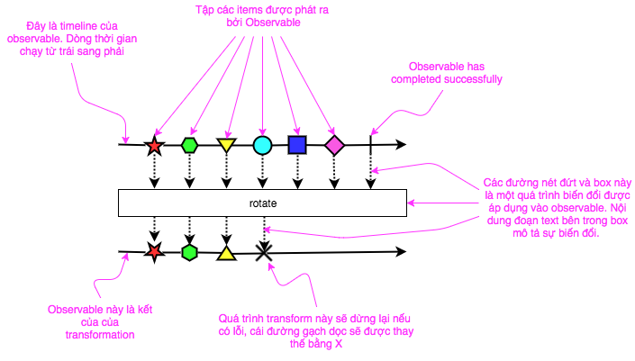
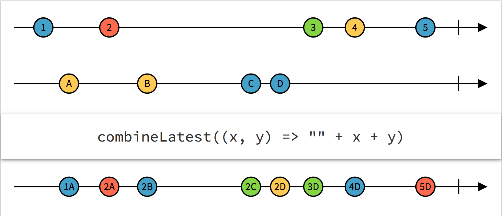
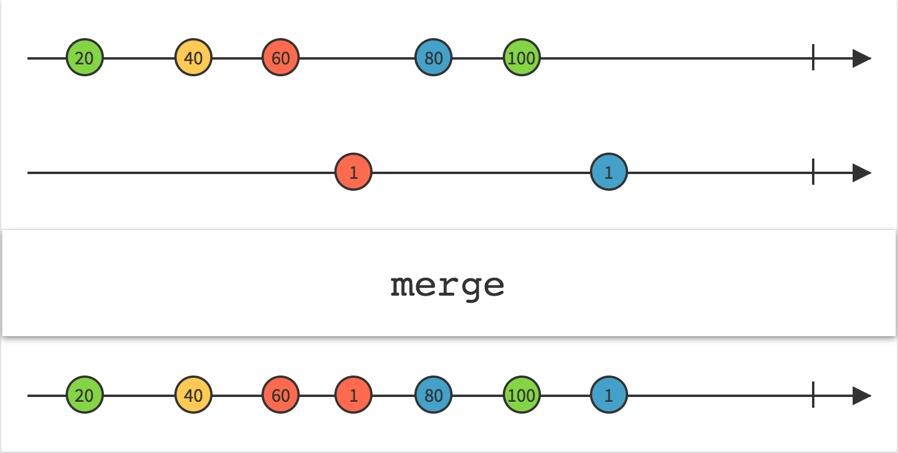
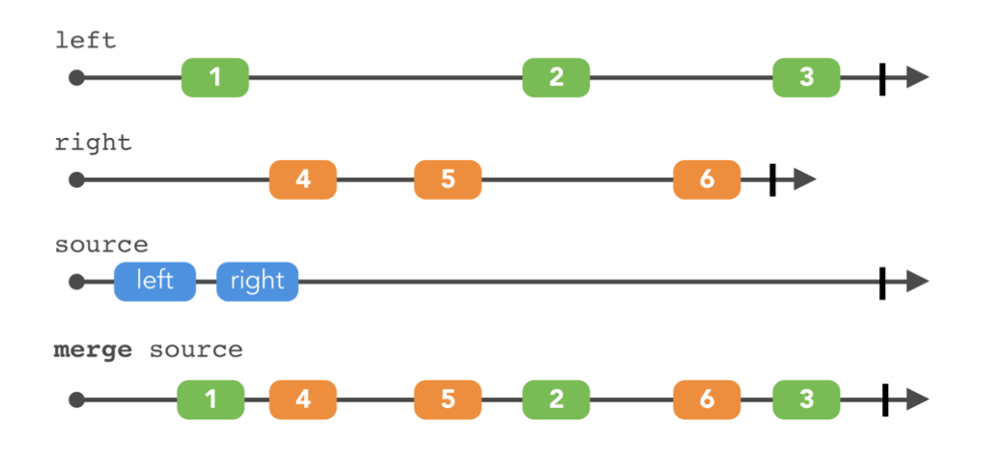
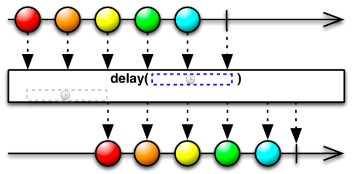
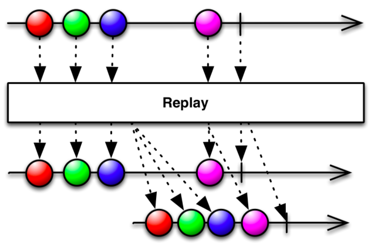

[TOC]

## 1. Approach


### 1.1. Delegation

```swift
let dev = Developer()
// dev.leader = Leader()
dev.start() // How can developer refer leader for decision making? 
```

```swift
private protocol DeveloperDelegation {
    func me(_ me: Developer, shouldStart task: Task) -> YesNo
}
```

```swift
private class Leader: DeveloperDelegation {
    func me(_ me: Developer, shouldStart task: Task) -> YesNo {
        switch task {
        case .implement(_): return Yes
        case .report:       return Yes
        case .drinkBeer:    return No
        }
    }
}
```

```swift
private class Developer {
    var leader: DeveloperDelegation!
    var tasks: [Task] = [.implement(taskId: "123"), .implement(taskId: "456"), .report, .drinkBeer]
    
    func start() {
        for task in tasks {
            guard leader.me(self, shouldStart: task) else { continue }
            start(task)
        }
        stop()
    }
    
    func start(_ task: Task) { }
    
    func stop() { }
}
```


### 1.2. Callback

The delegation is clear enough.

But, sometime:

- There's only one case in definition
- The refer's process only, no referenced subject is needed

Callback (completion block) is created for this.

```swift
let dev = Developer()
dev.start(.implement(taskId: "123"), completion: { result in
    switch result {
    case .merged:
        dev.start(.drinkBeer, completion: nil)
    case .rejected:
        dev.start(.report, completion: nil)
    }
})
```


### 1.3. Functional

```swift
typealias Minutes = Double
struct Ride {
    let name: String
    let categories: Set<RideCategory>
    let waitTime: Minutes
}
```

```swift
extension Array where Element == Ride {
    // imperative programming with insertion sort
    func _sortedNames() -> [String] {
        var names = [String]()
        for ride in self {
            names.append(ride.name)
        }
        for (i, name) in names.enumerated() {
            for j in stride(from: i, to: -1, by: -1) {
                if name.localizedCompare(names[j]) == .orderedAscending {
                    names.remove(at: i)
                    names.insert(name, at: j)
                }
            }
        }
        return names
    }

    // functional programming - what's order rule? that's all
    func sortedNames() -> [String] {
        return map { ride in ride.name }
            .sorted { s1, s2 in s1.localizedCompare(s2) == .orderedAscending }
    }
}
```


### 1.4. Promise

Promise - the golden path keeper & nested callback avoiding.

Implementation:

```swift
private class Developer {
    // via regular way
    func start(_ task: Task, completion: ((TaskResult) -> Void)?) {
        completion(.merged) // or
        completion(.rejected)
    }

    // via promise
    @discardableResult
    func start(_ task: Task) -> Promise<TaskResult> {
        return Promise { fulfill, reject in
            fulfill(.merged) // or
            reject(Issue.bug)
        }
    }
}
```

Usage:

```swift
let dev = Developer()
// via regular way
dev.start(.implement(taskId: "123"), completion: { result in
    switch result {
    case .merged:
        dev.start(.drinkBeer, completion: nil)
    case .rejected:
        dev.start(.report, completion: nil)
    }
})
// via promise
dev.start(.implement(taskId: "123"))
    .then { _ in dev.start(.drinkBeer) }
    .catch { _ in dev.start(.report) }
```

### 1.5. Reactive

## 2. Getting Started

### 2.1. Observable - starter

> Khái niệm observable đến từ observer design pattern là một đối tượng thông báo cho các đối tượng theo dõi về một điều gì đó đang diễn ra. [source](https://xgrommx.github.io/rx-book/content/observable/index.html#)

- Diagrams dưới đây đại diện cho  `Observables` và quá trình biến đổi của `Observables`:



- Trong [ReactiveX](http://reactivex.io/documentation/observable.html), một `observer` đăng ký một `Observable` sau đó `observer` sẽ phản ứng lại bất cứ item hay chuỗi các item mà `Observable` phát ra. Phần nãy sẽ giải thích reactive parttern là gì? `Observables`, `observers` là gì? và làm thế nào các `observers` đăng ký với `Observables`. 

#### 2.1.1 Mở đầu

- Có nhiều rất nhiều thuật ngữ dùng để mô tả mô hình và thiết kế của lập trình bất đồng bộ. Trong tài liệu này sẽ thống nhất sử dụng những thuật ngữ sau: Một `observer` đăng ký với `Observable`. Một `Observable` phát ra các items hoặc gửi các notifications đến các `observers` bằng cách gọi các `observers` methods, trong các tài liệu khác hoặc các ngữ cảnh khác, đôi lúc chúng ta gọi `observer` là một `subscriber`, `watcher` hoặc `reactor`. Mô hình thường được gọi là [reactor pattern](https://en.wikipedia.org/wiki/Reactor_pattern)

#### 2.1.2 Khởi tạo `Observers`

- Trong mô hình bất đồng bộ, flow sẽ giống như sau:

  1. Khai báo một method có giá trị được trả về từ một hàm gọi bất đồng bộ; method này là một phần của `*observer*`.
  2. Khai báo một `*Observable*`, 
  3. Gán `observer` vào `Observable` bằng cách đăng kí nó (*subscribing* it) .
  4. Xử lý các business logic bất cứ khi nào cuộc gọi trả về(whenever the call returns), method của `observer`  sẽ bắt đầu xử lý trên dựa trên giá trị trả về hoặc các giá trị (items) được phát ra bởi `Observerble`.

  ```groovy
  // Khai báo, nhưng không gọi, handler onNext của Subscriber
  // Trong ví dụ này, observer rất đơn giản và chỉ có onNext handler
  def myOnNext = { it -> do sth usefull with it }
  // defines, nhưng ko gọi, Observable
  def myObservable = someObservable(itsParameters);
  // Đăng ký Subscriber(myOnNext) Observable(myObservable), và invokes Observable
  myObservable.subscribe(myOnNext);
  // go on about my business
  ```

- **onNext, onCompleted, và onErrror**

  ​	[The `Subscribe` method](http://reactivex.io/documentation/operators/subscribe.html) là cách bạn kết nối `observer` với `Observable`. observer implement của bạn là tập hợp các methods dưới đây:

  `onNext`: `Observable` gọi hàm này bất cứ khi nào `Observable` phát đi item. Hàm này có tham số là item được phát ra bởi `Observable`.

  `onError`: `Observable` gọi hàm này để biểu thị có lỗi phát sinh trong khi xử lý dữ liệu hoặc có một số lỗi khá. Nó sẽ không gọi thêm đến các hàm `onNext` hoặc `onCompleted`. 

  `onCompleted`: `Observable` gọi hàm này sau khi hàm `onNext` cuối cùng được gọi, nếu không có bất kì lỗi nào xảy ra.

  A more complete `subscribe` call example looks like this:

  ```groovy
  def myOnNext = { item -> /* do something useful with item */ };
  def myError = { throwable -> /* react sensibly to a failed call */ };
  def myComplete = { /* clean up after the final response */ };
  def myObservable = someMethod(itsParameters);
  myObservable.subscribe(myOnNext, myError, myComplete);
  // go on about my business
  ```

- **"Hot" và "Cold" Observable**

  Khi nào `observable` phát ra chuỗi các `items`? Điều đó phụ thuộc vào `Observable`. Một "hot" Observable có thể bắt đầu phát các items ngay khi nó được tạo ra, và sau đó bất kỳ `Observer` nào đăng ký tới `observable` đều có thể bắt đầu quan sát (observing) từ khoản giữa của tiến trình . Trái lại, "Cold" observable thì chờ cho đến khi một `observer` nào đó đăng kí vào `observable` trước khi nó bắt đầu phát ra các items, và do đó `observer` có thể đảm bảo được việc quan sát từ toàn bộ các tiến trình từ lúc bắt đầu ( to see the whole sequence from the beginning.)

  [Read more](http://reactivex.io/documentation/observable.html)

### 2.2. Observer - handler

Sau khi đã khởi tạo **Observable**, thì subcribes **Observable** để nhận các sự kiện (events). Và ở đây, **Observer** dùng để nhận sự kiện mỗi khi có sự kiện phát ra.

**Observers** có thể nhận 3 kiểu sự kiện:

- **next**: Observable có thể có không hoặc nhiều elements nên sẽ có không hoặc nhiều `next` events được gửi tới **Observer** và đây là nơi để **Observer** nhận dữ liệu từ Observable.
- **completed**: nhận sự kiện này khi Observable hoàn thành life-cycle của nó, và không còn phát ra bất kỳ events nào nữa (không vào sự kiện **next** nữa)
- **error**: nhận sự kiện này khi Observable kết thúc với một error và tương tự như *completed*, **Observer** không nhận một sự kiện `next` nào nữa.

Sau khi phát sự kiện *completed* và *error*, thì các dữ liệu của **Observable** sẽ được giải phóng

**return** hàm `subscribe(_ observer: O)`  là **Disposable** dùng để cancel Observable và giải phóng bộ nhớ

**Example**

```swift
let obj = Observable.from(["🐶", "🐱", "🐭", "🐹"]) // Khởi tạo một Observable
obj.subscribe( // Thực hiện subscribe Observable
  onNext: { data in
    print(data) // Nơi nhận dữ liệu của Observer được gửi đi từ Observable
  }, 
  onError: { error in
    print(error) // Nơi nhận error và Observable được giải phóng
  }, 
  onCompleted: {
    print("Completed") // Nhận được sự kiện khi Observable hoàn thành life-cycle và Observable được giải phóng
  })
   .disposed()
```

```swift
🐶
🐱
🐭
🐹
Completed
```

**iOS**

```swift
@IBOutlet weak var textField: UITextField!

override func viewDidLoad() {
  super.viewDidLoad()
  let observable = textField.rx.text.orEmpty // Khởi tạo observable
  observable.subscribe(onNext: { (text) in 
  // Mỗi lần thay đổi text trong textField, Observer sẽ nhận được giá trị text mới của textField.
    print(text)
  })
}
```


### 2.3. Operator - man in the middle
Operators là những phép toán cho phép biển đổi observable thành observable mới để phù hợp với nhu cầu sử dụng

Một số operators cơ bản trong RxSwift được liệt kê tại mục 3.2

**Example 1:**


```swift
let observable = Observable.of(2,30,22,5,60,1) // 1
let newObservable = observable.filter { $0 > 10 } // 2
```
**OUTPUT: 30 22 60**

1. Khởi tạo observable các số nguyên --2--30--22--5--60--1
2. Qua phép filter với điều kiện ($0 > 10). Chúng ta đã có được một observable mới là --30--22--60


**Example 2:**
	Ở ví dụ này chúng ta sử dụng phép filter vào việc tìm kiếm bằng UISearchBar control

```swift	
let observable = searchBar.rx.text.orEmpty.asObservable() // 1   

observable.filter { $0.hasPrefix("Number") } // 2
.subscribe(onNext: { (text) in // 3
	// Do something when emit events
})
.disposed(by: disposeBag) // dispose it on deinit.
```
1. Khởi tạo observable thể hiện cho sự thay đổi nội dung của search bar
2. Lọc nội dụng bắt đầu bằng chuỗi `Number`
3. Subcrible một observable để có thể xử lý mỗi khi nội dung search bar thay đổi

## 3. Deep Dive

### 3.1. Creation

Có một vài cách để tạo **Observable**

#### 3.1.1. just

Tạo một *Observable* với một *single element*.


`just` chuyển đổi một *item* vào trong một **Observable** mà sẽ phát ra chính *item* đó.

**Examples**

```swift
import RxSwift

Observable.just("🔴")
    .subscribe { event in
        print(event)
    }.dispose()
```

```swift
// Kết quả
next(🔴)
completed
```

```swift
import RxSwift
import RxCocoa
import UIKit

weak var label: UILabel!

func setupLabel() {
	let observable = Observable.just("This is text")
    .subscribe(onNext: { text in
        label.text = text
    })
}
```

#### 3.1.2. from

Tạo một *Observable* từ một *Sequence* như Array, Dictionary hay Set.


Một hàm khởi tạo *Observable* quan trọng, khi làm việc với *Observable* có thể dễ dàng biểu diễn dự liệu của ứng dụng sang **Observable**.

**Examples**

```swift
import RxSwift
Observable.from(["🐶", "🐱", "🐭", "🐹"])
    .subscribe(onNext: { print($0) })
    .dispose()
```

```swift
// Kết quả
🐶
🐱
🐭
🐹
```

```swift
import RxSwift
import RxCocoa
import UIKit

// Need examples for iOS
```

#### 3.1.3. create

Tạo một custom **Observable** với input bất kỳ với **create**.


Tạo một custom **Observable** với đầu vào bất kì, và custom lúc nào gọi **observer** handle sự kiện (onNext, onError, onComplete)

**Examples**

```swift
import RxSwift

let disposeBag = DisposeBag()    
let myJust = { (element: String) -> Observable<String> in
    // return một Observable custom
    return Observable.create { observer in
        // Biến đổi input element
        let newElement = "New: \(element)"
        
        // Gọi observer handle sự kiện next
        observer.on(.next(newElement))
        // Gọi observer handle sự kiện completion
        observer.on(.completed)
        return Disposables.create()
    }
}
myJust("🔴")
.subscribe { print($0) }
.disposed(by: disposeBag)
```

```swift
// Kết quả
next(New: 🔴)
completed
```

```swift
import RxSwift
import RxCocoa
import UIKit

weak var usernameTextField: UITextField!
weak var passwordTextField: UITextField!
weak var loginButton: UIButton!

// Custom một Observable
let userObservable = { (username, password) -> Observable<User> in
    return Observable.create { observer in 
               let user = User(username: username, password: password)
               observer.onNext(user)
               return Disposables.create()
           }
}

func setupObservable() {
  // Observables
  let username = usernameTextField.rx.text.orEmpty
  let password = passwordTextField.rx.text.orEmpty
  let loginTap = loginButton.rx.tap.asObservable()
  
  // Đọc thêm phần combineLatest
  let combineLastestData = Observable.combineLatest(username, password) { ($0, $1) }
  
  let loginObservable: Observable<User> = loginTap
                                          .withLatestFrom(combineLastestData)
                                          .flatMapLatest { (username, password) in
                                              return userObservable(username, password) 
                                          }

  loginObservable.bind { [weak self] user in
      // Call API With User
  }.dispose()
}

final class User {
    let username: String = ""
    var password: String?

    init(username: String, password: String? = nil) {
        self.username = username
        self.password = password
    }
}
```

#### 3.1.4. range

Tạo một *Observable* mà phát ra một dãy các số nguyên tuần tự


**Examples**

```swift
import RxSwift

Observable.range(start: 1, count: 10)
          .subscribe { print($0) }
          .dispose()
```

```swift
// Kết quả
next(1)
next(2)
next(3)
next(4)
next(5)
next(6)
next(7)
next(8)
next(9)
next(10)
completed
```

```swift
import RxSwift
import RxCocoa
import UIKit

// Examples for iOS
```

#### 3.1.5. repeatElement

Tạo một *Observable* mà phát ra một element nhiều lần


Sau khi khởi tạo *Observable* với **repeatElement**, Observable sẽ phát liên tục với element input

**Examples**

```swift
import RxSwift

Observable.repeatElement("🔴")
          .take(3) // Sử dụng operator này để nhận 3 lần phát từ Observable, nếu không sử dụng, thì Observable sẽ phát liên tục
          .subscribe(onNext: { print($0) })
          .dispose()
```

```swift
// Kết quả
🔴
🔴
🔴
```

```swift
// Need for iOS
```

#### 3.1.6. doOn

Tạo một *Observable* kèm operator **doOn** có thể chèn thêm logic vào trước các event methods của **Observer** đã định nghĩa.


**Examples**:

```swift
import RxSwift

Observable.from([1, 2, 3, 5, 7]).do(onNext: { (number) in
            print("doOn      -----> \(number)")
        }).subscribe(onNext: { (number) in
            print("subscribe -----> \(number)")
        }).dispose()
```

```swift
// Kết quả
doOn      -----> 1
subscribe -----> 1
doOn      -----> 2
subscribe -----> 2
doOn      -----> 3
subscribe -----> 3
doOn      -----> 5
subscribe -----> 5
doOn      -----> 7
subscribe -----> 7
```


#### 3.1.7. empty, never, of, generate, deferred, error

Ngoài ra có các operator khác để tạo **Observable**

See `Creating Observables`: [Creating Observables](http://reactivex.io/documentation/operators.html#creating)

### 3.2. Operators

#### 3.2.1. Conditional

#### 3.2.2. Combination

Ở phần này, chúng ta sẽ đi qua một số cách để có thể **combine** các observable. Có  một số **operator** sẽ tương tự và quen thuộc trong *swift*.
Ok, đầu tiên chúng ta đến với `combineLatest`:

**Combining elements**:



Như *diagram* ở trên, thì mỗi khi chúng ta muốn *combine* các **observable** lại với nhau, và mong muốn rằng **observable** mới này sẽ có dữ liệu được coi là cuối cùng từ những **observable** được đem đi *conbine*.

Toán tử được sử dụng đó là `conbineLatest`.

Hãy xem 1 đoạn code ví dụ sau đây: 

Đầu tiên khởi tạo 2 **observable**:

```swift
// 1 setup observable
let first = PublishSubject<String>()
let second = PublishSubject<String>()
```

Tiếp theo, dùng `combineLatest` để có thể có 1 **observable** mà chúng ta cần là *combining* dữ liệu:

```swift
// 2 using combineLatest
let observable = Observable.combineLatest(first, second, resultSelector: { (lastFirst, lastSecond) in
	print(lastFirst + " - " + lastSecond)
})
let disposable = observable.subscribe()
```

Bây giờ, *emit* dữ liệu nào:

```swift
// 3
print("> Sending a value to First")
first.onNext("Hello,")
print("> Sending a value to Second")
second.onNext("world")
print("> Sending another value to Second")
second.onNext("RxSwift")
print("> Sending another value to First")
first.onNext("Have a good day,")
```

Đừng quên *dispose* nó nhé:

```swift
disposable.dispose()
```

OK, giờ thì xem thử kết quả và…:

```swift
> Sending a value to First
> Sending a value to Second
Hello, - world
> Sending another value to Second
Hello, - RxSwift
> Sending another value to First
Have a good day, - RxSwift
```

**iOS**: 

Sau đây là ví dụ thường gặp trong iOS mà sử dụng `combineLatest`:

```swift
// 1: First, set up 3 outlets: 2 textfield `username`, `password` and a button `login`
@IBOutlet private weak var usernameTextField: UITextField!
@IBOutlet private weak var passwordTextField: UITextField!
@IBOutlet private weak var loginButton: UIButton!

// 2: Now, create 2 observable of username and password
let userName = usernameTextField.rx.text.orEmpty
let password = passwordTextField.rx.text.orEmpty

// 3: Next, create validate observable (Observable<Bool>)
let validateUserName = userName.map({ $0.characters.count >= 6 })
let validatePassword = password.map({ $0.characters.count >= 6 })

// 4: Using `combineLatest` to check valid
// Then, binding into `loginButton` to enable or not.
Observable.combineLatest(validateUserName, validatePassword) { $0 && $1 }
	.bind({ valid in
    	loginButton.isEnable = valid
	})
```

Thử để biết kết quả nha.


**Triggers** (`withLatestFrom`):

Cũng gần giống như `combineLatest`, function `withLatestFrom` này được xem như là trigger.

Tại vì sao nhĩ? Dễ thôi, bởi vì khi chúng ta cần nhận dữ liệu từ 1 **observable** nào đó mà cần phải thõa mãn điều kiện gì đó, để dẽ hiểu hơn thì giả sử thỏa mản này là dấu hiệu phát ra từ 1 **observable** khác.

Ví dụ đơn giản là hãy nghĩ rằng chúng ta đang có 1 `TextField` và 1`Button` nhé, OK. Chúng ta sẽ lấy được *text* từ `TextField` chỉ khi nào `Button` được *tap*. Vậy đó, hành động tap của `Button` mà lại thỏa mản điều kiện để chúng ta được phép lấy *text* thì gọi hành động đó là trigger.

Rồi, tiếp theo là code ví dụ nha:

```swift
// 1 Tạo button và textfield ^^
let button = PublishSubject<Any>()
let textField = PublishSubject<String>()
```

Bây giờ dùng *button* như trigger nào, nghĩa là khi nào button được *tap* thì lấy *text* mới nhất của textfield.

**subscribe** MY YOUTUBE CHANEL, à không, **obserable** vừa tạo ra để nhận dữ liệu thôi.

```swift
// 2
let observable = button.withLatestFrom(textField)
let disposable = observable.subscribe(onNext: { (value) in
    print(value)
})
```

Rồi, giờ thì *bắn* vài phát để kiểm tra hì

```swift
// 3
textField.onNext("Rx")
textField.onNext("RxSw")
button.onNext("tap")
textField.onNext("RxSwift")
button.onNext("tap")
button.onNext("tap")

disposable.dispose()
```

Ai da, kết quả ai hiểu nạ.

```swift
RxSw
RxSwift
RxSwift
```

Không cần *diagram* cho ví dụ trên đâu. Dễ hiểu quá mà

Nhưng sẽ có *diagram* tường mình hơn cho `withLatestFrom` nha.

Ở đây, *x* (trên) là trigger, *x*  mà bắn thì  **observable** dưới cùng mới nhận được dữ liệu nha.


**iOS**:

Và đây là ví dụ cho trường hợp dùng `withLatestFrom` trong iOS

```swift
// 1: First, set up 3 outlets: 2 textfield `username`, `password` and a button `login`
@IBOutlet private weak var usernameTextField: UITextField!
@IBOutlet private weak var passwordTextField: UITextField!
@IBOutlet private weak var loginButton: UIButton!

// 2: Now, create 2 Observable<String>, and a Observable<Void>
let userName = usernameTextField.rx.text.orEmpty
let password = passwordTextField.rx.text.orEmpty
let buttonTap = loginButton.rx.tap.asObserable()

// 3: Next, combine 2 observables
let userAndPassword = Observable.combineLatest(input.userName, input.pw) {($0, $1)}


// 4: Using `withLatestFrom` to get latest values
buttonTap.withLatestFrom(userAndPassword)
	.flatMapLatest { (user, password) in
    	// get latest user and password to login.
	}

```


**Merging**: 

*Diagram* dưới nói lên tất cả cho `merge` nhĩ.




Bây vô ví dụ luôn:

Tạo 2 **observable**

```swift
// 1
let left = PublishSubject<String>()
let right = PublishSubject<String>()
```

Bây giờ, sử dụng `merge` và subscribe để tí nữa xem kết quả

```swift
// 2
let source = Observable.of(left, right)
let observable = source.merge()
let disposable = observable.subscribe(onNext: { (value) in
    print(value)
})
```

*Bắn* như mọi khi

```swift
// 3
print("> Sending a value to Left")
left.onNext("1")
print("> Sending a value to Right")
right.onNext("4")
print("> Sending another value to Right")
right.onNext("5")
print("> Sending another value to Left")
left.onNext("2")
print("> Sending another value to Right")
right.onNext("6")
print("> Sending another value to Left")
left.onNext("3")
```

Chạy code trên ta được điều cần chứng minh: :D

```swift
> Sending a value to Left
1
> Sending a value to Right
4
> Sending another value to Right
5
> Sending another value to Left
2
> Sending another value to Right
6
> Sending another value to Left
3
```

Đây, *diagram* cho ví dụ trên:




**Switches**:

  * `amb` - *ambiguous*:

    Hoặc được biết tới với tên là `race`, được sử dụng cho 2 hoặc nhiều **observable**, và nó *bắn* ra *event* từ **observable** bắn event ra đầu tiên.

    Haiza, khó hiểu hì :S, đơn giản là cái **observable** được sinh ra từ thằng `amb` này sẽ *bắn* ra event từ cái **observable** thành viên nào có thời điểm *bắn* là sớm nhất. Đấy đôi khi *sớm* mới được người ta thấy. :D

    

    Với *diagram* trên, chúng ta thấy là **observable** thứ 2 sẽ *bắn* đầu tiên, thì **observable** được sinh ra sẽ chỉ *bắn* các event của **observable** thứ 2 này.

    ​

    Thử đoạn code demo sau:

    ```swift
    let left = PublishSubject<String>()
    let right = PublishSubject<String>()

    // 1 observable mới sinh ra từ `left` và `right` sau khi dùng `amb`
    let observable = left.amb(right)
    let disposable = observable.subscribe(onNext: { value in
        print(value)
    })

    left.onNext("London")
    right.onNext("Copenhagen")
    left.onNext("Lisbon")
    left.onNext("Madrid")
    right.onNext("Vienna")
    right.onNext("Ha Noi")
    right.onNext("HCM")
    disposable.dispose()
    ```

    Kết quả in ra sẽ là:

    ```
    London
    Lisbon
    Madrid
    ```

    ​

  * `switchLatest`:

    Tất nhiên vẫn sẽ là *combine* các **observable** lại với nhau và thành 1 **observable** mới, và **observable** này sẽ *emit* ra những event mà thuộc **observable** gần nhất *emit* ra.

    Khó hiểu thật, đọc xong câu đó ngơ lun.

    Dễ hiểu là thế này, từ `switch` đúng nghĩa của nó luôn là giả sử có 1 cái công tắc (không phải bật và tắt) mà là để thông dòng điện chẳng hạn, gạt lên gạt xuống thì dòng 1 hoặc dòng 2 được thông.

    Vậy đó…. dòng mới sẽ là điện từ 1 trong 2 dòng trước đó được gạt từ cái công tắc. :D Thế này mà không hiểu nữa thì…. đọc lại lần nữa nha.

    

    Xem luôn cái code ví dụ này:

    ```swift
    // 1: Có 3 dòng điện, ý... 3 observable (one, two, three).
    let one = PublishSubject<String>()
    let two = PublishSubject<String>()
    let three = PublishSubject<String>()
    // 1 observable với kiểu là 1 observable kiểu String... não đâu rồi...
    let source = PublishSubject<Observable<String>>()

    // 2 tạo 1 observable mới từ switchLatest
    let observable = source.switchLatest()
    let disposable = observable.subscribe(onNext: { value in
        print(value)
    })

    // 3
    source.onNext(one)
    one.onNext("Some text from sequence one")
    two.onNext("Some text from sequence two")
    source.onNext(two)
    two.onNext("More text from sequence two")
    one.onNext("and also from sequence one")
    source.onNext(three)
    two.onNext("Why don't you see me?")
    one.onNext("I'm alone, help me")
    three.onNext("Hey it's three. I win.")
    source.onNext(one)
    one.onNext("Nope. It's me, one!")

    disposable.dispose()
    // Xem kết quả nha...
    ```

    ```
    Some text from sequence one
    More text from sequence two
    Hey it's three. I win.
    Nope. It's me, one!
    ```

    > Chú ý: đoạn thứ 3, khi chúng ta *switch* các **observable** khác nhau, tất nhiên mỗi lần chỉ 1, thì event được bắn ra là event của **observable** đó, còn các **observable** còn lại có bắn ra bao nhiêu đi nữa cũng bị ignore, bị nằm trong black list, bị friend zone hết.

    ​

    **Prefixing and concatenating**:

    - **``startWith()``**:

      Với function này, chúng ta sẽ chỉ định **observable** *emit* ra một số *event* nhất định nào đó trước khi  *emit* ra các *event* của nó.

    

    ​	Xem đoạn ví dụ sau đây:

    ```swift
    // 1
    let numbers = Observable.of(2, 3)
    // 2
    let observable = numbers.startWith(1)
    observable.subscribe(onNext: { value in
        print(value)
    })
    ```

    ​	Đối với   `startWith`, nó tạo ra 1 **observable** mới với giá trị khởi tạo ban đầu, và giá trị ban đầu này phải cùng kiểu với giá trị của **observable** trước đó.

    ​	Sau đây là những gì xảy ra với code ví dụ ở trên:

    1. Tạo 1 **observable** kiểu `Int`.
    2. Dùng `startWith` để tạo một **observable** mới với giá trị ban đầu là 1.

    Kết quả sau khi run code:

    ```swift
    1
    2
    3
    ```

    ​

    - **``concat()``**:

      Tất nhiên toán tử này vẫn là **combine** hai hoặc nhiều **observable** lại với nhau, nhưng theo một trình tự liên tiếp nhau.

      Nhìn *diagram* sau để có thể hiểu hơn nha:

    

    ​

    ​	Đoạn code ví dụ cho *diagram* trên:

    ```swift
    // 1
    let first = Observable.of(1, 1, 1)
    let second = Observable.of(2, 2)
    // 2
    let observable = Observable.concat([first, second])
    observable.subscribe(onNext: { value in
        print(value)
    }) 
    ```

    ```swift
    1
    1
    1
    2
    2
    ```

    ​

    **Zip**:

    Cũng như `combineLatest`, nhưng lần này khác biệt ở chổ, nó *combine* những **observable** lại với nhau một cách tuần tự (element thứ nhất của **observable** 1 sẽ được *combine* với element thứ nhất của **observable** 2 tương tự như vậy nếu có nhiều hơn 2).

    

    Bây giờ, xem ví dụ sau:

    ```swift
    // 1
    let first = PublishSubject<String>()
    let second = PublishSubject<String>()

    // 2
    let observable = Observable.zip(first, second, resultSelector: { (lastFirst, lastSecond) in
        print(lastFirst + " - " + lastSecond)
    })
    let disposable = observable.subscribe()

    // 3
    print("> Sending a value to First")
    first.onNext("Hello,")
    print("> Sending a value to Second")
    second.onNext("world")
    print("> Sending another value to Second")
    second.onNext("RxSwift")
    print("> Sending another value to First")
    first.onNext("Have a good day,")

    disposable.dispose()
    ```

    > Chú ý: so sánh với ví dụ `combineLatest` để xem sự khác biệt nha.


#### 3.2.3. Filtering

#### 3.2.4. Mathematical

#### 3.2.5. Transformation

Rất vui khi chúng ta đã đi qua hơn một nữa chặn đường tìm hiểu về `RxSwift`. Tới đây thì chúng ta cảm thấy `RxSwift` không quá khó đúng không?

> Phần này được coi là một trong những phần quan trọng nhất của `Rxswift` nhé.

Sơ lượt, những toán tử thuộc *Transformation* giúp chúng ta biến đổi một **observable**.

Vâng... giúp biến đổi, nhưng biến đổi thành cái gì và biến đổi như thế nào ???

Còn tùy… OK, mình sẽ dẫn chứng cho các bạn biết vì sao lại *còn tùy*.

Có một điều là lâu nay mọi người vẫn đang và đã sài vài phép biến đổi này trong *Swift*, *chúng nó* là **hàm** *native* do **Apple** cung cấp hẳn hoi nhé.

Một số *toàn tử* đó là **map**, **flatMap**, …. Đấy, nếu dùng rồi thì mọi người sẽ nhận ra rằng biến đổi thành gì và như thế nào rõ ràng là do chính bạn, bạn mong muốn gì thì bạn làm thôi.

> Trên đó chỉ là một cách dẫn chứng cho mọi người có thể dễ dàng hình dung về **Transformation** thôi.
>
> Chứ trong thực tế **map**, **flatMap** hay một vài hàm khác do *Apple* cung cấp khác với các toán tử cùng tên trong `RxSwift` nha. Sau khi xong phần này mọi người tự so sánh để biết được khác biệt đó ở đâu nha.


OK,,, bắt đầu với **Transformation** nào.

**`buffer`**:

Cứ theo chu kỳ, những *item* được bắn ra từ **observable** sẽ tập hợp lại thành một gói theo số lượng buffer trước. Điều đó có nghĩa là thay vì bắn ra riêng lẻ từng item thì sau khi dùng `buffer` sẽ bắn ra từng gói (mỗi gói sẽ có nhiều item).


Sau đây là code ví dụ về `buffer`:

```swift
_ = Observable<Int>.interval(0.1, scheduler: MainScheduler.instance)
		.map { Int($0) }
		.buffer(timeSpan: 1, count: 10, scheduler: MainScheduler.instance)
		.subscribe({ (value) in
			print(value)
		})
```

Chú ý tới toán tử buffer thì có tham số `timeSpan` và `count`, chính xác thì 2 tham số này quy định cái *gói* chứa *item* sẽ to bao nhiêu. 

​	**count**: số lượng item trong 1 *gói*

​	**timeSpan**: tổng thời gian có thể có để chứa các item. (Hãy tưởng tượng thế này, cái bao của bạn chỉ có 1s để hứng các *item* thôi, thì giả sử **count** là không giới hạn thì trong item nào được phát ra trong khoảng thời gian 1s đó thì được cho vào gói đó, nếu phát ra ở giây sau đó thì vào gói sau).

Khai chạy code trên thì kết quả như sau:

```swift
next([0, 1, 2, 3, 4, 5, 6, 7, 8])
next([9, 10, 11, 12, 13, 14, 15, 16, 17, 18])
next([19, 20, 21, 22, 23, 24, 25, 26, 27, 28])
next([29, 30, 31, 32, 33, 34, 35, 36, 37, 38])
next([39, 40, 41, 42, 43, 44, 45, 46, 47, 48])
```


**`map`**:

Biến đổi từng *item* của một **observable** để trở thành một **observable** mới.


Như *diagram* trên thì mỗi *item* đều được biến đổi bằng các nhân với 10.

Dưới đây là code ví dụ cho *diagram* trên:

```swift
let observable = Observable<Int>.of(1, 2, 3)
observable.map { $0 * 10 }
	.subscribe(onNext: { value in
		print(value)
	}).dispose()
```

Kết quả:

```swift
10
20
30
```


**`flatMap`**:

Giúp chúng ta làm *phẳng* các *item* vào một **observable** duy nhất.

Nhìn kỹ *diagram* dưới thì mọi người sẽ thấy ban đầu **observable** sẽ *emit* ra những *item* mà những *item* này có thể là 1 **observable** khác, thì sau khi dùng `flatMap` mọi *item* sẽ được làm phẳng ra trong 1 **observable** duy nhất.


Sau đây là một ví dụ cho `flatMap`:

```swift
let disposeBag = DisposeBag()

struct Player {
    var score: Variable<Int>
}

let 👦🏻 = Player(score: Variable<Int>(80))
let player = Variable(👦🏻)
player.asObservable()
    .flatMap { $0.score.asObservable() }
    .subscribe(onNext: { print("score: \($0)") })
    .disposed(by: disposeBag)
player.asObservable()
    .flatMap({ $0.score.asObservable().map({ $0 * 10 })})
    .subscribe(onNext: { print("score: \($0)") })
    .disposed(by: disposeBag)
```

Kết quả: 

```swift
score: 80
score: 800
```


**`groupBy`**:

Chia một **observable** thành một tập các **observable** khác theo một điều kiện nào đó.


Hãy thử ví dụ sau để có thể hiểu hơn về `groupBy`:

```swift
// Define một struct `Message`
struct Message {
    var id: Int
    var msgContent: String
    var date: String
    var isRead: Bool
}

// Setup một mảng messages
let messages = [
    Message(id: 1001, msgContent: "TextContent1", date: "2017-01-01", isRead: true),
    Message(id: 1002, msgContent: "TextContent2", date: "2017-01-01", isRead: false),
    Message(id: 1003, msgContent: "TextContent3", date: "2017-01-01", isRead: true),
    Message(id: 1004, msgContent: "TextContent4", date: "2017-01-01", isRead: false),
    Message(id: 1005, msgContent: "TextContent5", date: "2017-01-01", isRead: false),
    Message(id: 1006, msgContent: "TextContent6", date: "2017-01-01", isRead: true)
]

// Tạo một observable sau đó group theo cờ `isRead`
let source = Observable.from(messages)
let group = source.groupBy { $0.isRead }

// ****
group
    .map({ (item) -> Observable<Message> in
        if item.key {
            return item.asObservable()
        }
        return Observable<Message>.of()
    })
    .flatMap({ $0.asObservable() })
    .subscribe(onNext: {
        print($0)
    })
    .disposed(by: disposeBag)
```

Kết quả:

```swift
Message #1(id: 1001, msgContent: "TextContent1", date: "2017-01-01", isRead: true)
Message #1(id: 1003, msgContent: "TextContent3", date: "2017-01-01", isRead: true)
Message #1(id: 1006, msgContent: "TextContent6", date: "2017-01-01", isRead: true)
```


**`scan`**:

Các *item* được bắn ra sau khi được biến đổi dựa trên giá trị của *item* trước đó, và sẽ dựa vào giá trị ban đầu được cung cấp nếu là *item* đầu tiên.

Xem *diagram* sau đây:


Một đoạn code demo cho *diagram* trên:

```swift
let observable = Observable<Int>.of(1, 2, 3, 4, 5)
observable
    .scan(0) { (seed, value) -> Int in
        return seed + value
    }
    .toArray()
    .subscribe(onNext: {
        print($0)
    })
    .disposed(by: disposeBag)
```

```swift
[1, 3, 6, 10, 15]
```


**`window`**:


Tương tự với `buffer` được cung cấp ở đầu phần này, nhưng khác biệt ở chổ là các *item* sẽ được chia vào các **observable** thay vì là ***MỘT*** **observable** với các *item* là mảng giá trị.

```swift
_ = Observable<Int>.interval(0.1, scheduler: MainScheduler.instance)
        .map { Int($0) }
        .window(timeSpan: 1, count: 10, scheduler: MainScheduler.instance)
        .flatMap({ $0 })
        .subscribe({ (value) in
            print(value)
        })
```


```swift
next(0)
next(1)
next(2)
next(3)
next(4)
next(5)
next(6)
next(7)
next(8)
next(9)
next(10)
next(11)
```

Đấy rất khác…..


Ok,,, các bạn đã đi hết phần này.

Tuy nhiên trên đó mình chỉ liệt kê ra những toán tử điển hình và hay dùng, mọi người tự tìm hiểu thêm về những toán tử còn lại nha.

#### 3.2.6. Time Based

Trước khi đi vào phần này, mình sẽ giải thích MainScheduler là gì? Đơn giản quá, nó tương tự như DispatchQueue.main, được sử dụng cho những task liên quan đến UI và nó là SerialDispatchQueue.

- **Timeout**

Cho 1 khoảng thời gian Timeout. Sau khi subscribe, trong vòng 3s mà không có event nào phát đi kể từ lần cuối phát event hay subscribe thì sẽ trả về Timeout Error và ngắt Observable.


```swift
let dueTime: RxTimeInterval = 3
// Khởi tạo 1 PublishSubject.
let publicSubject = PublishSubject<Int>()

// Áp dụng timeout vào publishSubject.
// Sau khi subscribe nếu trong vòng 3s mà không có event nào phát đi kể từ lần cuối phát event hay subscribe thì sẽ trả về timeout error và ngắt observable.
_ = publicSubject.timeout(dueTime, scheduler: MainScheduler.instance)
	.subscribe(onNext: {
		print("Element: ", $0)
	}, onError: {
		print("Timeout Error")
		print($0)
	})

// Khởi tạo 1 observable timer interval, timer này có nhiệm vụ cứ mỗi giây phát ra 1 event.
let timer = Observable<Int>.interval(1, scheduler: MainScheduler.instance)
_ = timer.subscribe({
  	// Nếu event nhận được từ timer có element <=5 thì publishSubject sẽ phát đi event.
	if let e = $0.element, e <= 5 {
		publicSubject.onNext(e)
	}
})
```

```swift
// Output: Mỗi giây publishSubject phát ra 1 event.
element:  0
element:  1
element:  2
element:  3
element:  4
element:  5
// Đoạn này element >5 nên không phát gì được nữa. Cùng nhìn xem sau 3s ra cái gì nhé!
Timout error
Sequence timeout.
```


- **Delay**

Observable được phát ra sau 1 khoảng delay.



```swift
let delayInSeconds: RxTimeInterval = 3
// Khởi tạo 1 PublicSubject
let publicSubject = PublishSubject<Int>()

// Áp dụng delay vào publishSubject với dueTime = 3. 
// Nghĩa là sau khi subscribe, nếu publishSubject phát ra event thì sau 3s subsribe mới nhận được event.
_ = publicSubject.delay(delayInSeconds, scheduler: MainScheduler.instance).subscribe({
	print($0)
})

publicSubject.onNext("Sau 3s mới nhận được nhé!")
```

```swift
// Output: Chờ 3s và nhận kết quả nhé.
next(Sau 3s mới nhận được nhé!)
```


- **Window**

Tách observable từ observable sau 1 khoảng thời gian (timespan) và số lượng event cho phép tối đa (count).


```swift
let bufferTimeSpan: RxTimeInterval = 3
let bufferMaxCount = 2
// Khởi tạo 1 PublicSubject
let publicSubject = PublishSubject<Int>()

// Áp dụng window vào publishSubject với bufferTimeSpan = 3 và bufferMaxCount = 2. 
// Nghĩa là sau mỗi 3s sẽ tách ra 1 observable con chứa những event được phát ra trong khoảng 3s đó từ observable mẹ (Tối đa là 2 event).
_ = publicSubject.window(timeSpan: bufferTimeSpan, count: bufferMaxCount, scheduler: MainScheduler.instance).subscribe({
	if let element = $0.element {
		print("New Observable")
		_ = element.subscribe({
			print($0)
		})
	}
})

// Khởi tạo 1 observable timer interval, timer này có nhiệm vụ cứ mỗi giây phát ra 1 event.
let timer = Observable<Int>.interval(1, scheduler: MainScheduler.instance)
_ = timer.subscribe({
  	// Nếu event nhận được từ timer có element < 6 thì publishSubject sẽ phát đi event.
	if let e = $0.element, e < 6 {
		publicSubject.onNext(e)
	}
})
```

```swift
// Output: Trong 6s sẽ tạo ra được 3 observable mới.
New Observable
next(0)
next(1)
completed

New Observable
next(2)
next(3)
completed

New Observable
next(4)
next(5)
completed
```


- **Replay**

Sau khi subscribe sẽ lấy lại được nhiều event trước đó.



```swift
let replayedElements = 3
// Khởi tạo 1 PublicSubject
let publicSubject = PublishSubject<Int>()

// Áp dụng replay vào publishSubject với replayedElements = 3. 
// Nghĩa là sau khi subscribe sẽ nhận lại được tối đa 3 event trước đó nếu có.
let replayObservable = publicSubject.replay(replayedElements)
_ = replayObservable.connect()

// publicSubject phát đi 5 events.
for i in 0...4 {
	publicSubject.onNext(i)
}

_ = replayObservable.subscribe({
	print("replay: ", $0)
})
```

```swift
// Output:
next(0)
next(1)
next(2)
next(3)
next(4)
replay:  next(2)
replay:  next(3)
replay:  next(4)
```


- **Buffer**

Biến đổi `observable<Type> ` thành `observable<[Type]>` .


```swift
let bufferTimeSpan: RxTimeInterval = 3
let bufferMaxCount = 3
// Khởi tạo 1 PublicSubject
let publicSubject = PublishSubject<Int>()

// Áp dụng buffer vào publishSubject với timeSpan = 3 và count = 3. 
// Nghĩa là sau khi subscribe sẽ nhận được tập hợp những event được phát đi trong khoảng 3 giây và tối đa là 3 event.
_ = publicSubject.buffer(timeSpan: bufferTimeSpan, count: bufferMaxCount, scheduler: MainScheduler.instance).subscribe({
	print($0)
})

// Khởi tạo 1 observable timer interval, timer này có nhiệm vụ cứ mỗi giây phát ra 1 event.
let timer = Observable<Int>.interval(1, scheduler: MainScheduler.instance)
_ = timer.subscribe({
  	// Nếu event nhận được từ timer có element < 6 thì publishSubject sẽ phát đi event.
	if let e = $0.element, e < 6 {
		publicSubject.onNext(e)
	}
})
```

```swift
// Output:
Event nhận được sau khi buffer:  next([0, 1, 2])
Event nhận được sau khi buffer:  next([3, 4, 5])
```


## 4. Testing

### 4.1. RxTest

### 4.2. RxNimble

https://academy.realm.io/posts/testing-functional-reactive-programming-code/

## 5. References


