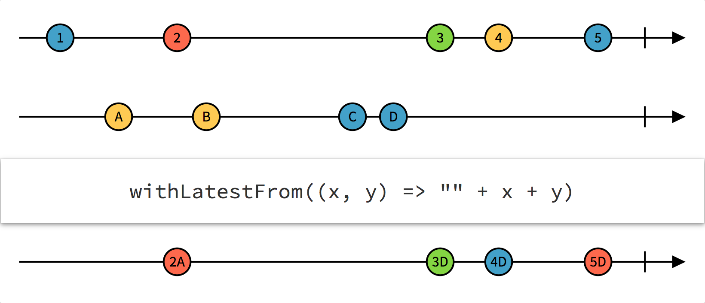
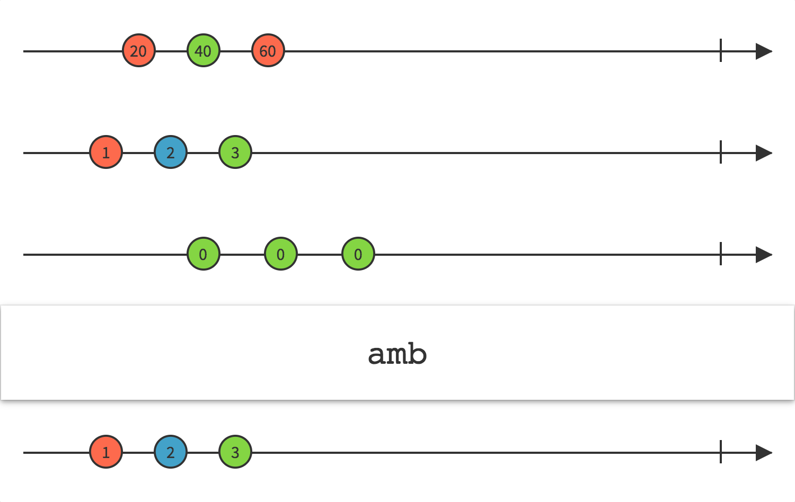
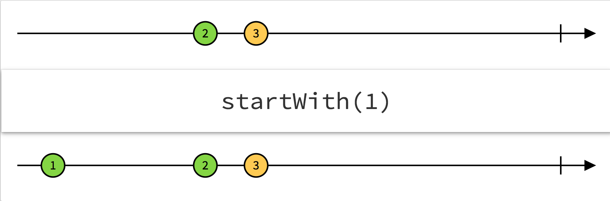
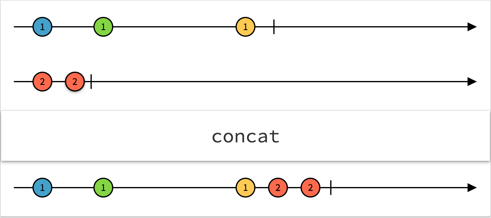
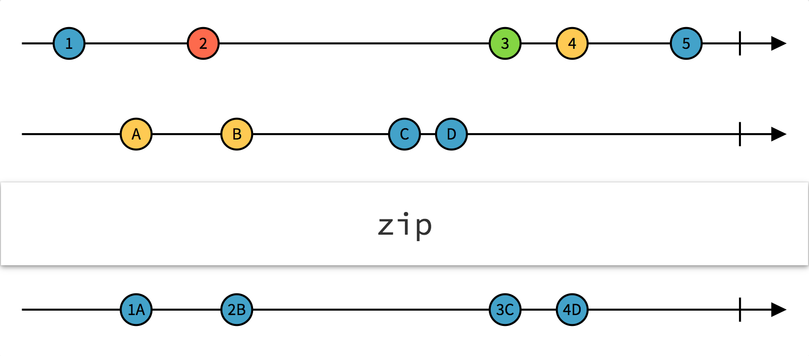

Ở phần này, chúng ta sẽ đi qua một số cách để có thể **combine** các observable. Có  một số **operator** sẽ tương tự và quen thuộc trong *swift*.
Ok, đầu tiên chúng ta đến với `combineLatest`:

**Combining elements**:


Như *diagram* ở trên, thì mỗi khi chúng ta muốn *combine* các **observable** lại với nhau, và mong muốn rằng **observable** mới này sẽ có dữ liệu được coi là cuối cùng từ những **observable** được đem đi *conbine*.

Toán tử được sử dụng đó là `conbineLatest`.

Hãy xem 1 đoạn code ví dụ sau đây: 

Đầu tiên khởi tạo 2 **observable**:

```swift
// 1 setup observable
let first = PublishSubject<String>()
let second = PublishSubject<String>()
```

Tiếp theo, dùng `combineLatest` để có thể có 1 **observable** mà chúng ta cần là *combining* dữ liệu:

```swift
// 2 using combineLatest
let observable = Observable.combineLatest(first, second, resultSelector: { (lastFirst, lastSecond) in
	print(lastFirst + " - " + lastSecond)
})
let disposable = observable.subscribe()
```

Bây giờ, *emit* dữ liệu nào:

```swift
// 3
print("> Sending a value to First")
first.onNext("Hello,")
print("> Sending a value to Second")
second.onNext("world")
print("> Sending another value to Second")
second.onNext("RxSwift")
print("> Sending another value to First")
first.onNext("Have a good day,")
```

Đừng quên *dispose* nó nhé:

```swift
disposable.dispose()
```

OK, giờ thì xem thử kết quả và…:

```swift
> Sending a value to First
> Sending a value to Second
Hello, - world
> Sending another value to Second
Hello, - RxSwift
> Sending another value to First
Have a good day, - RxSwift
```

**iOS**: 

Sau đây là ví dụ thường gặp trong iOS mà sử dụng `combineLatest`:

```swift
// 1: First, set up 3 outlets: 2 textfield `username`, `password` and a button `login`
@IBOutlet private weak var usernameTextField: UITextField!
@IBOutlet private weak var passwordTextField: UITextField!
@IBOutlet private weak var loginButton: UIButton!

// 2: Now, create 2 observable of username and password
let userName = usernameTextField.rx.text.orEmpty
let password = passwordTextField.rx.text.orEmpty

// 3: Next, create validate observable (Observable<Bool>)
let validateUserName = userName.map({ $0.characters.count >= 6 })
let validatePassword = password.map({ $0.characters.count >= 6 })

// 4: Using `combineLatest` to check valid
// Then, binding into `loginButton` to enable or not.
Observable.combineLatest(validateUserName, validatePassword) { $0 && $1 }
	.bind({ valid in
    	loginButton.isEnable = valid
	})
```

Thử để biết kết quả nha.


**Triggers** (`withLatestFrom`):

Cũng gần giống như `combineLatest`, function `withLatestFrom` này được xem như là trigger.

Tại vì sao nhĩ? Dễ thôi, bởi vì khi chúng ta cần nhận dữ liệu từ 1 **observable** nào đó mà cần phải thõa mãn điều kiện gì đó, để dẽ hiểu hơn thì giả sử thỏa mản này là dấu hiệu phát ra từ 1 **observable** khác.

Ví dụ đơn giản là hãy nghĩ rằng chúng ta đang có 1 `TextField` và 1`Button` nhé, OK. Chúng ta sẽ lấy được *text* từ `TextField` chỉ khi nào `Button` được *tap*. Vậy đó, hành động tap của `Button` mà lại thỏa mản điều kiện để chúng ta được phép lấy *text* thì gọi hành động đó là trigger.

Rồi, tiếp theo là code ví dụ nha:

```swift
// 1 Tạo button và textfield ^^
let button = PublishSubject<Any>()
let textField = PublishSubject<String>()
```

Bây giờ dùng *button* như trigger nào, nghĩa là khi nào button được *tap* thì lấy *text* mới nhất của textfield.

**subscribe** MY YOUTUBE CHANEL, à không, **obserable** vừa tạo ra để nhận dữ liệu thôi.

```swift
// 2
let observable = button.withLatestFrom(textField)
let disposable = observable.subscribe(onNext: { (value) in
    print(value)
})
```

Rồi, giờ thì *bắn* vài phát để kiểm tra hì

```swift
// 3
textField.onNext("Rx")
textField.onNext("RxSw")
button.onNext("tap")
textField.onNext("RxSwift")
button.onNext("tap")
button.onNext("tap")

disposable.dispose()
```

Ai da, kết quả ai hiểu nạ.

```swift
RxSw
RxSwift
RxSwift
```

Không cần *diagram* cho ví dụ trên đâu. Dễ hiểu quá mà

Nhưng sẽ có *diagram* tường mình hơn cho `withLatestFrom` nha.

Ở đây, *x* (trên) là trigger, *x*  mà bắn thì  **observable** dưới cùng mới nhận được dữ liệu nha.



**iOS**:

Và đây là ví dụ cho trường hợp dùng `withLatestFrom` trong iOS

```swift
// 1: First, set up 3 outlets: 2 textfield `username`, `password` and a button `login`
@IBOutlet private weak var usernameTextField: UITextField!
@IBOutlet private weak var passwordTextField: UITextField!
@IBOutlet private weak var loginButton: UIButton!

// 2: Now, create 2 Observable<String>, and a Observable<Void>
let userName = usernameTextField.rx.text.orEmpty
let password = passwordTextField.rx.text.orEmpty
let buttonTap = loginButton.rx.tap.asObserable()

// 3: Next, combine 2 observables
let userAndPassword = Observable.combineLatest(input.userName, input.pw) {($0, $1)}


// 4: Using `withLatestFrom` to get latest values
buttonTap.withLatestFrom(userAndPassword)
	.flatMapLatest { (user, password) in
    	// get latest user and password to login.
	}

```


**Merging**: 

*Diagram* dưới nói lên tất cả cho `merge` nhĩ.


Bây vô ví dụ luôn:

Tạo 2 **observable**

```swift
// 1
let left = PublishSubject<String>()
let right = PublishSubject<String>()
```

Bây giờ, sử dụng `merge` và subscribe để tí nữa xem kết quả

```swift
// 2
let source = Observable.of(left, right)
let observable = source.merge()
let disposable = observable.subscribe(onNext: { (value) in
    print(value)
})
```

*Bắn* như mọi khi

```swift
// 3
print("> Sending a value to Left")
left.onNext("1")
print("> Sending a value to Right")
right.onNext("4")
print("> Sending another value to Right")
right.onNext("5")
print("> Sending another value to Left")
left.onNext("2")
print("> Sending another value to Right")
right.onNext("6")
print("> Sending another value to Left")
left.onNext("3")
```

Chạy code trên ta được điều cần chứng minh: :D

```swift
> Sending a value to Left
1
> Sending a value to Right
4
> Sending another value to Right
5
> Sending another value to Left
2
> Sending another value to Right
6
> Sending another value to Left
3
```

Đây, *diagram* cho ví dụ trên:


**Switches**:

  * `amb` - *ambiguous*:

    Hoặc được biết tới với tên là `race`, được sử dụng cho 2 hoặc nhiều **observable**, và nó *bắn* ra *event* từ **observable** bắn event ra đầu tiên.

    Haiza, khó hiểu hì :S, đơn giản là cái **observable** được sinh ra từ thằng `amb` này sẽ *bắn* ra event từ cái **observable** thành viên nào có thời điểm *bắn* là sớm nhất. Đấy đôi khi *sớm* mới được người ta thấy. :D

    

    Với *diagram* trên, chúng ta thấy là **observable** thứ 2 sẽ *bắn* đầu tiên, thì **observable** được sinh ra sẽ chỉ *bắn* các event của **observable** thứ 2 này.

    ​

    Thử đoạn code demo sau:

    ```swift
    let left = PublishSubject<String>()
    let right = PublishSubject<String>()

    // 1 observable mới sinh ra từ `left` và `right` sau khi dùng `amb`
    let observable = left.amb(right)
    let disposable = observable.subscribe(onNext: { value in
        print(value)
    })

    left.onNext("London")
    right.onNext("Copenhagen")
    left.onNext("Lisbon")
    left.onNext("Madrid")
    right.onNext("Vienna")
    right.onNext("Ha Noi")
    right.onNext("HCM")
    disposable.dispose()
    ```

    Kết quả in ra sẽ là:

    ```
    London
    Lisbon
    Madrid
    ```

    ​

  * `switchLatest`:

    Tất nhiên vẫn sẽ là *combine* các **observable** lại với nhau và thành 1 **observable** mới, và **observable** này sẽ *emit* ra những event mà thuộc **observable** gần nhất *emit* ra.

    Khó hiểu thật, đọc xong câu đó ngơ lun.

    Dễ hiểu là thế này, từ `switch` đúng nghĩa của nó luôn là giả sử có 1 cái công tắc (không phải bật và tắt) mà là để thông dòng điện chẳng hạn, gạt lên gạt xuống thì dòng 1 hoặc dòng 2 được thông.

    Vậy đó…. dòng mới sẽ là điện từ 1 trong 2 dòng trước đó được gạt từ cái công tắc. :D Thế này mà không hiểu nữa thì…. đọc lại lần nữa nha.

    

    Xem luôn cái code ví dụ này:

    ```swift
    // 1: Có 3 dòng điện, ý... 3 observable (one, two, three).
    let one = PublishSubject<String>()
    let two = PublishSubject<String>()
    let three = PublishSubject<String>()
    // 1 observable với kiểu là 1 observable kiểu String... não đâu rồi...
    let source = PublishSubject<Observable<String>>()

    // 2 tạo 1 observable mới từ switchLatest
    let observable = source.switchLatest()
    let disposable = observable.subscribe(onNext: { value in
        print(value)
    })

    // 3
    source.onNext(one)
    one.onNext("Some text from sequence one")
    two.onNext("Some text from sequence two")
    source.onNext(two)
    two.onNext("More text from sequence two")
    one.onNext("and also from sequence one")
    source.onNext(three)
    two.onNext("Why don't you see me?")
    one.onNext("I'm alone, help me")
    three.onNext("Hey it's three. I win.")
    source.onNext(one)
    one.onNext("Nope. It's me, one!")

    disposable.dispose()
    // Xem kết quả nha...
    ```

    ```
    Some text from sequence one
    More text from sequence two
    Hey it's three. I win.
    Nope. It's me, one!
    ```

    > Chú ý: đoạn thứ 3, khi chúng ta *switch* các **observable** khác nhau, tất nhiên mỗi lần chỉ 1, thì event được bắn ra là event của **observable** đó, còn các **observable** còn lại có bắn ra bao nhiêu đi nữa cũng bị ignore, bị nằm trong black list, bị friend zone hết.

    ​

    **Prefixing and concatenating**:

    - **``startWith()``**:

      Với function này, chúng ta sẽ chỉ định **observable** *emit* ra một số *event* nhất định nào đó trước khi  *emit* ra các *event* của nó.

    

    ​	Xem đoạn ví dụ sau đây:

    ```swift
    // 1
    let numbers = Observable.of(2, 3)
    // 2
    let observable = numbers.startWith(1)
    observable.subscribe(onNext: { value in
        print(value)
    })
    ```

    ​	Đối với   `startWith`, nó tạo ra 1 **observable** mới với giá trị khởi tạo ban đầu, và giá trị ban đầu này phải cùng kiểu với giá trị của **observable** trước đó.

    ​	Sau đây là những gì xảy ra với code ví dụ ở trên:

    1. Tạo 1 **observable** kiểu `Int`.
    2. Dùng `startWith` để tạo một **observable** mới với giá trị ban đầu là 1.

    Kết quả sau khi run code:

    ```swift
    1
    2
    3
    ```

    ​

    - **``concat()``**:

      Tất nhiên toán tử này vẫn là **combine** hai hoặc nhiều **observable** lại với nhau, nhưng theo một trình tự liên tiếp nhau.

      Nhìn *diagram* sau để có thể hiểu hơn nha:

    

    ​

    ​	Đoạn code ví dụ cho *diagram* trên:

    ```swift
    // 1
    let first = Observable.of(1, 1, 1)
    let second = Observable.of(2, 2)
    // 2
    let observable = Observable.concat([first, second])
    observable.subscribe(onNext: { value in
        print(value)
    }) 
    ```

    ```swift
    1
    1
    1
    2
    2
    ```

    ​

    **Zip**:

    Cũng như `combineLatest`, nhưng lần này khác biệt ở chổ, nó *combine* những **observable** lại với nhau một cách tuần tự (element thứ nhất của **observable** 1 sẽ được *combine* với element thứ nhất của **observable** 2 tương tự như vậy nếu có nhiều hơn 2).

    

    Bây giờ, xem ví dụ sau:

    ```swift
    // 1
    let first = PublishSubject<String>()
    let second = PublishSubject<String>()

    // 2
    let observable = Observable.zip(first, second, resultSelector: { (lastFirst, lastSecond) in
        print(lastFirst + " - " + lastSecond)
    })
    let disposable = observable.subscribe()

    // 3
    print("> Sending a value to First")
    first.onNext("Hello,")
    print("> Sending a value to Second")
    second.onNext("world")
    print("> Sending another value to Second")
    second.onNext("RxSwift")
    print("> Sending another value to First")
    first.onNext("Have a good day,")

    disposable.dispose()
    ```

    > Chú ý: so sánh với ví dụ `combineLatest` để xem sự khác biệt nha.


