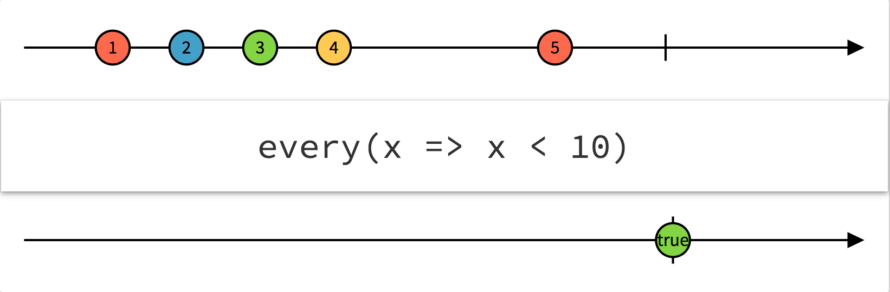
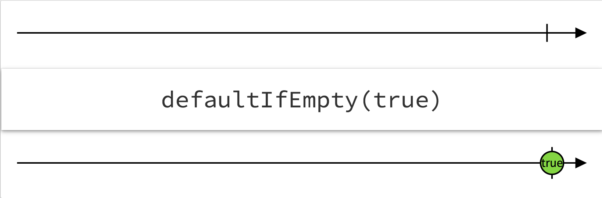

> Operators that evaluate one or more Observables or items emitted by Observables

Trên là định nghĩa về phần **Conditional** của *ReactiveX*.

Cơ bản, nhóm toán tử này dùng để *đánh giá* (kiểm tra) một hoặc nhiều **observable** hoặc là *item* của nó.



Như mọi người thấy *diagram* trên đang đánh giá **observable**, nếu tất cả các *item* đều nhỏ hơn 10 thì sẽ *emit* ra **true**.

Trong đó có thể có vài toán tử hoạt động gần giống hoặc là toán tử đã được liệt kê ở các phần khác như `amb`, `skipUntil`… và cũng có một vài toán tử chưa có trong *RxSwift* như: `all` hay `every`, `contains`, `sequenceEqual`.


Dưới đây ví dụ cho một toán tử `defaultIfEmpty`, nhưng trong *RxSwift* có tên là `ifEmpty`:

**`ifEmpty`**:

Nếu như một **observable** mà rỗng thì sẽ *emit* ra một giá trị mặt định.



Sau đây là code ví dụ:

```swift
let observable = Observable<Int>.of()
let evaluateObservable = observable.ifEmpty(default: 42)
evaluateObservable.subscribe(onNext: { print($0) }).dispose()
```


Mọi người có thể tìm đọc kỹ hơn về các toán tử của phần này [tại đây](http://reactivex.io/documentation/operators.html#conditional)

