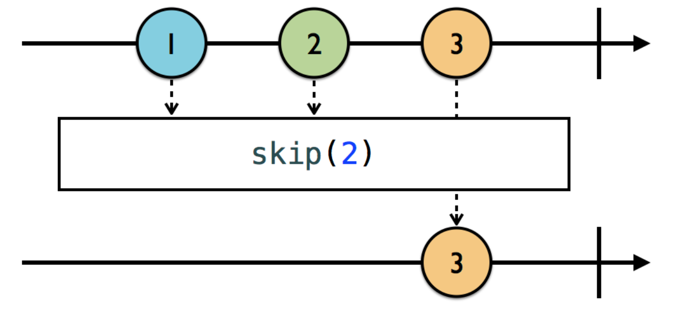
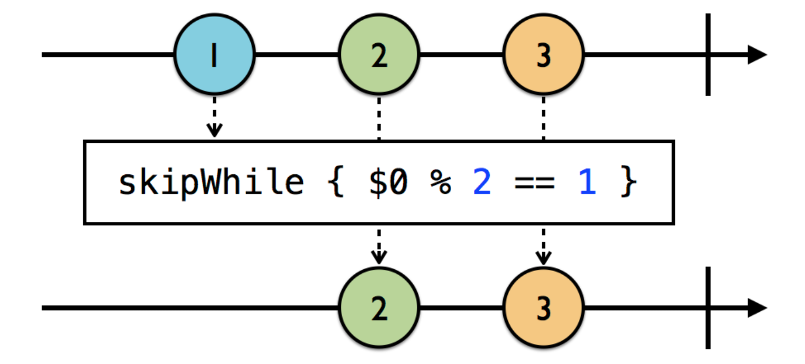
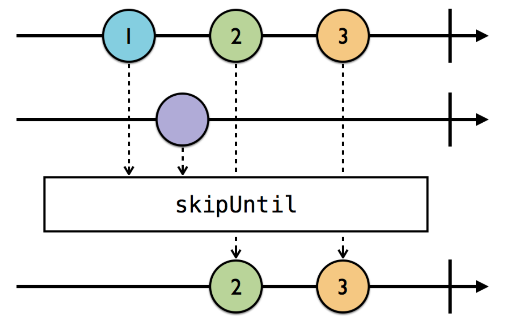
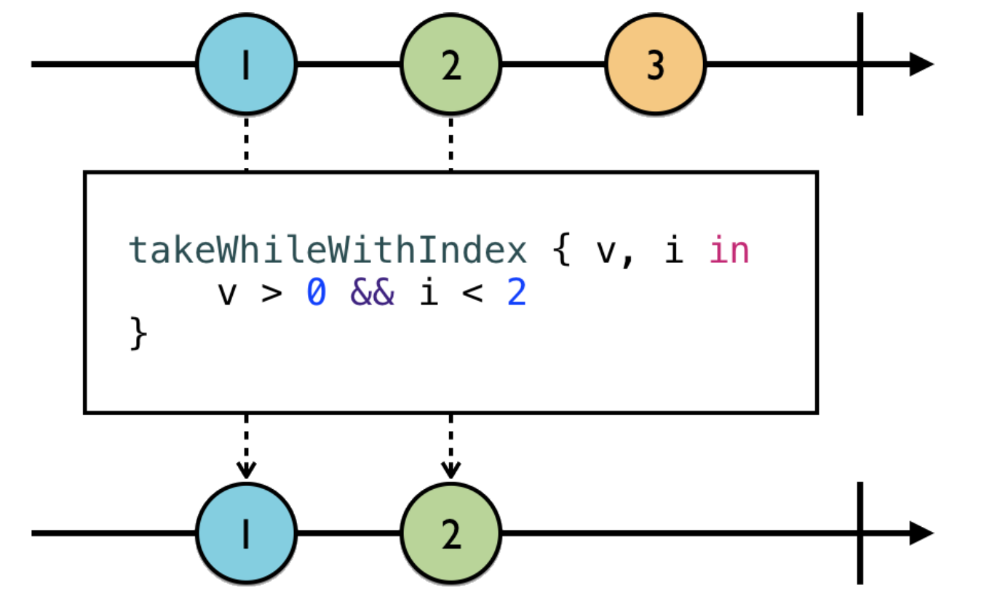
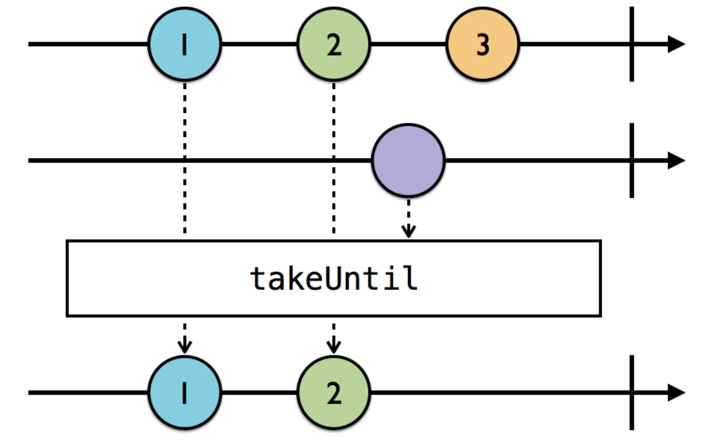
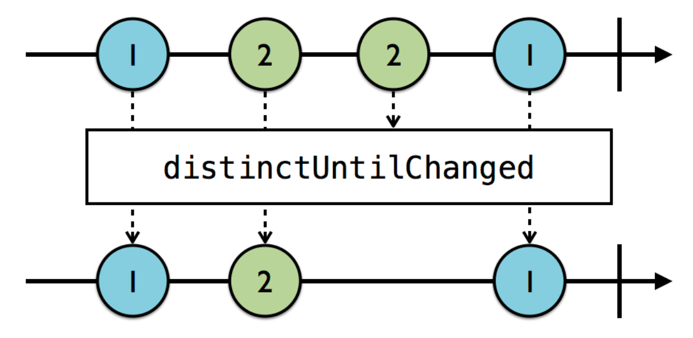

Cũng giống như filter trong swift. **Filtering** cho phép loại bỏ những items không mong đợi được phát ra để được **observable** mới phù hợp với mục đích của người dùng.

Nhắc đến *Filtering* trong RxSwift thì ta có một số operators sau: **Ignoring**, **Skipping**, **Taking**, **Distinct**. 

Sau đây là một số ví dụ để hiểu rõ hơn về các operators này

##### Ignoring operators
-  `ignoreElements()`

  Bỏ qua tất cả các items được phát ra. Nhưng vẫn cho phép xử lý sự kiện **.completed** và **.error**.

  

```swift
  let strikes = PublishSubject<String>()
  let disposeBag = DisposeBag()
  // Đăng ký lắng nghe những items được phát ra nhưng lại ignore chúng đi.
  strikes
    .ignoreElements()
    .subscribe { _ in
     print("You're out!")
    }
    .disposed(by: disposeBag)
```

```swift
strikes.onNext("X")
strikes.onNext("Y")
strikes.onNext("Z")
strikes.onCompleted()

--- Output ---
You're out!
```
-  `elementAt()`

  Đôi lúc chúng ta lại muốn xử lý sự kiện tại một thời điểm nào đó. `elementAt(n)` cho phép xử lý sự kiện được phát ra tại lần phát thứ n và sẽ bỏ qua tất cả sự kiện khác.


```swift
  let strikes = PublishSubject<String>()
  let disposeBag = DisposeBag()

  strikes
    .elementAt(2)
    .subscribe(onNext: { item in
      print(item)
    })
    .disposed(by: disposeBag)
```

```swift
strikes.onNext("A")
strikes.onNext("B")
strikes.onNext("C")

--- Output ---
C
```

​	

##### Skipping operators
-  `skip(n)`

  **Skip** operator cho phép bạn bỏ qua các items được phát ra từ lần phát thứ 1 đến n.

  

```swift
let disposeBag = DisposeBag()
Observable.of("A", "B", "C", "D", "E", "F")
  // Bỏ qua các items được phát từ lần phát thứ 1 đến 3.
  .skip(3)
  .subscribe(onNext: {
	  print($0) })
  .disposed(by: disposeBag)
```

```swift
--- Output ----
D
E
F
```

-  `skipWhile()`

  `skipWhile()` nó cũng tương tự như `filter`. Nó cho phép đưa ra một điều kiện cụ thể để xác định những items nào sẽ được bỏ qua. Tuy nhiên, có một sự khác biệt giữa chúng. Trong khi `filter` sẽ lọc qua tất cả items, thì `skipWhile` chỉ bỏ qua cho đến khi có một item nào đó không thoả điều kiện nữa. Nó sẽ dừng việc bỏ qua và cho phép mọi thứ thông qua từ thời điểm đó.

  
  ​	
```swift
let disposeBag = DisposeBag()
Observable.of(2, 2, 3, 4, 4)
  // Sẽ bỏ qua những items chia hết cho 2 cho đến khi nó gặp 1 item không thoả mãn.
  .skipWhile { integer in
    integer % 2 == 0
  }
  .subscribe(onNext: {
    print($0)
}).disposed(by: disposeBag)
```

```swift
--- Output ----
3
4
4
```

-  `skipUntil()`

  Nó sẽ bỏ qua những items được phát ra từ **source observable** cho đến khi **trigger observable** phát item đầu tiên.

  

```swift
let disposeBag = DisposeBag()
// subject sẽ phát ra các items
// trigger được dùng như là 1 cái cò để báo dừng việc bỏ qua các items đó
  let subject = PublishSubject<String>()
  let trigger = PublishSubject<String>()

subject
  .skipUntil(trigger)
  .subscribe(onNext: {	
		print($0) })
  .disposed(by: disposeBag)
```

```swift
// Đầu tiên subject sẽ phát đi 2 items. Nhưng không có gì được in ra.
	Vì chúng đang được skip.
subject.onNext("A")
subject.onNext("B")

// Khi trigger phát đi 1 item thì việc bỏ qua những item phát ra bởi
   subject sẽ được ngăn chặn. Có nghĩa là từ thời điểm đó mọi sự kiện
   được phát ra từ subject được thông qua.
trigger.onNext("X")

subject.onNext("C")
```

```swift
--- Output --- 
C
```


##### Taking operators
- `take()`

  Đối lập với **skiping** thì ta có phép **taking**. Nếu `skip(n)` cho phép bỏ qua những items được phát từ lần phát thứ 1 đến thứ n. Thì `take(n)` cho phép nhận những items được phát từ lần phát thứ 1 đến thứ n.

  
  
```swift
let disposeBag = DisposeBag()
Observable.of(1, 2, 3, 4, 5, 6)
  // Nhận các items từ lần phát thứ 1 đến thứ 3
  .take(3)
  .subscribe(onNext: {
     print($0) })
  .disposed(by: disposeBag)
```

```swift
--- Output ---
1
2
3
```

- `takeWhileWithIndex()`

  Ở phần **skiping operator** chúng ta có định nghĩa `skipWhile()` thì tương tự ở phần này chúng ta cũng sẽ có `takeWhile()`. Mở rộng hơn một chút, đôi lúc chúng ta lại muốn sử dụng chỉ số (index) của item được phát ra để thoả mãn điều kiện lọc nào đó. `takeWhileWithIndex()` sẽ giải quyết vấn đề này.

  
  ​	
```swift
let disposeBag = DisposeBag()
Observable.of(2, 2, 4, 4, 6, 6)
  // Chỉ lấy những item là số chẵn và có index < 3 
  .takeWhileWithIndex { integer, index in
    integer % 2 == 0 && index < 3
  }
  .subscribe(onNext: {
    print($0)
})
  .disposed(by: disposeBag)
```

```swift
--- Output ---
2
2
4
```

- `takeUntil()`

 Tương tự `skipUntil()` ở đây chúng ta cũng sẽ có `takeUntil()`. Sẽ nhận những item được phát ra từ **source observable** cho đến khi **trigger observable** phát ra item đầu tiên.


​	
```swift
let disposeBag = DisposeBag()
// subject sẽ phát ra các items
// trigger được dùng như là 1 cái cò để báo dừng việc nhận 
	các items được phát ra từ subject
  let subject = PublishSubject<String>()
  let trigger = PublishSubject<String>()

subject
  .takeUntil(trigger)
  .subscribe(onNext: {	
		print($0) })
  .disposed(by: disposeBag)
  
subject.onNext("1")
subject.onNext("2")
trigger.onNext("Stop")
subject.onNext("3")
subject.onNext("4")
```

```swift
--- Output ---
1
2
```

##### Distinct operators

-  `distinctUntilChanged()`

  `distinctUntilChanged` sẽ bỏ qua việc những items bị duplicate nằm **liền kề nhau**. 

  Chúng ta có thể hiểu đơn giản như sau: Nếu trong một khoảng thời gian một observable phát đi những event liên tiếp giống nhau. Thì `distinctUntilChanged` sẽ chỉ nhận 1 item đầu tiên và sẽ bỏ qua tất cả items trùng lặp **nằm liền kề** phía sau đó. 

   Như *marble diagram* thì ta có thấy `distinctUntilChanged` chỉ giữ item **2** được phát ra lần đầu tiên và sẽ bỏ qua những item **2** nằm liền kề bên phải nó.

  

```swift
let disposeBag = DisposeBag()
Observable.of("A", "A", "B", "B", "A")
  .distinctUntilChanged()
  .subscribe(onNext: {
    print($0) })
  .disposed(by: disposeBag)
```

```swift
--- Output ---
A
B
A
```