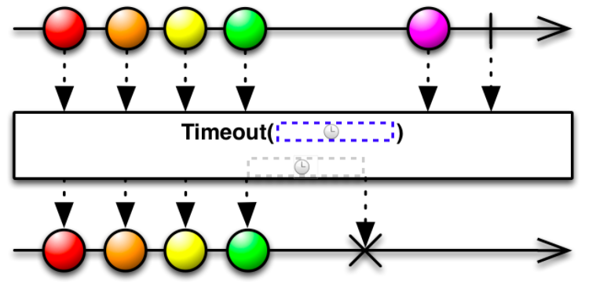
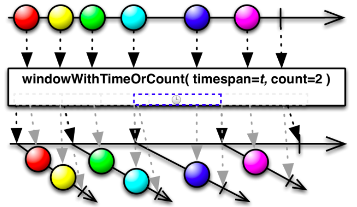
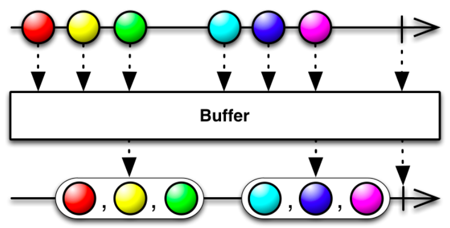

#### Time Based

Trước khi đi vào phần này, mình sẽ giải thích MainScheduler là gì? Đơn giản quá, nó tương tự như DispatchQueue.main, được sử dụng cho những task liên quan đến UI và nó là SerialDispatchQueue.

- **Timeout**

Cho 1 khoảng thời gian Timeout. Sau khi subscribe, trong vòng 3s mà không có event nào phát đi kể từ lần cuối phát event hay subscribe thì sẽ trả về Timeout Error và ngắt Observable.



```swift
let dueTime: RxTimeInterval = 3
// Khởi tạo 1 PublishSubject.
let publicSubject = PublishSubject<Int>()

// Áp dụng timeout vào publishSubject.
// Sau khi subscribe nếu trong vòng 3s mà không có event nào phát đi kể từ lần cuối phát event hay subscribe thì sẽ trả về timeout error và ngắt observable.
_ = publicSubject.timeout(dueTime, scheduler: MainScheduler.instance)
	.subscribe(onNext: {
		print("Element: ", $0)
	}, onError: {
		print("Timeout Error")
		print($0)
	})

// Khởi tạo 1 observable timer interval, timer này có nhiệm vụ cứ mỗi giây phát ra 1 event.
let timer = Observable<Int>.interval(1, scheduler: MainScheduler.instance)
_ = timer.subscribe({
  	// Nếu event nhận được từ timer có element <=5 thì publishSubject sẽ phát đi event.
	if let e = $0.element, e <= 5 {
		publicSubject.onNext(e)
	}
})
```

```swift
// Output: Mỗi giây publishSubject phát ra 1 event.
element:  0
element:  1
element:  2
element:  3
element:  4
element:  5
// Đoạn này element >5 nên không phát gì được nữa. Cùng nhìn xem sau 3s ra cái gì nhé!
Timout error
Sequence timeout.
```


- **Delay**

Observable được phát ra sau 1 khoảng delay.


```swift
let delayInSeconds: RxTimeInterval = 3
// Khởi tạo 1 PublicSubject
let publicSubject = PublishSubject<Int>()

// Áp dụng delay vào publishSubject với dueTime = 3. 
// Nghĩa là sau khi subscribe, nếu publishSubject phát ra event thì sau 3s subsribe mới nhận được event.
_ = publicSubject.delay(delayInSeconds, scheduler: MainScheduler.instance).subscribe({
	print($0)
})

publicSubject.onNext("Sau 3s mới nhận được nhé!")
```

```swift
// Output: Chờ 3s và nhận kết quả nhé.
next(Sau 3s mới nhận được nhé!)
```


- **Window**

Tách observable từ observable sau 1 khoảng thời gian (timespan) và số lượng event cho phép tối đa (count).



```swift
let bufferTimeSpan: RxTimeInterval = 3
let bufferMaxCount = 2
// Khởi tạo 1 PublicSubject
let publicSubject = PublishSubject<Int>()

// Áp dụng window vào publishSubject với bufferTimeSpan = 3 và bufferMaxCount = 2. 
// Nghĩa là sau mỗi 3s sẽ tách ra 1 observable con chứa những event được phát ra trong khoảng 3s đó từ observable mẹ (Tối đa là 2 event).
_ = publicSubject.window(timeSpan: bufferTimeSpan, count: bufferMaxCount, scheduler: MainScheduler.instance).subscribe({
	if let element = $0.element {
		print("New Observable")
		_ = element.subscribe({
			print($0)
		})
	}
})

// Khởi tạo 1 observable timer interval, timer này có nhiệm vụ cứ mỗi giây phát ra 1 event.
let timer = Observable<Int>.interval(1, scheduler: MainScheduler.instance)
_ = timer.subscribe({
  	// Nếu event nhận được từ timer có element < 6 thì publishSubject sẽ phát đi event.
	if let e = $0.element, e < 6 {
		publicSubject.onNext(e)
	}
})
```

```swift
// Output: Trong 6s sẽ tạo ra được 3 observable mới.
New Observable
next(0)
next(1)
completed

New Observable
next(2)
next(3)
completed

New Observable
next(4)
next(5)
completed
```


- **Replay**

Sau khi subscribe sẽ lấy lại được nhiều event trước đó.


```swift
let replayedElements = 3
// Khởi tạo 1 PublicSubject
let publicSubject = PublishSubject<Int>()

// Áp dụng replay vào publishSubject với replayedElements = 3. 
// Nghĩa là sau khi subscribe sẽ nhận lại được tối đa 3 event trước đó nếu có.
let replayObservable = publicSubject.replay(replayedElements)
_ = replayObservable.connect()

// publicSubject phát đi 5 events.
for i in 0...4 {
	publicSubject.onNext(i)
}

_ = replayObservable.subscribe({
	print("replay: ", $0)
})
```

```swift
// Output:
next(0)
next(1)
next(2)
next(3)
next(4)
replay:  next(2)
replay:  next(3)
replay:  next(4)
```


- **Buffer**

Biến đổi `observable<Type> ` thành `observable<[Type]>` .



```swift
let bufferTimeSpan: RxTimeInterval = 3
let bufferMaxCount = 3
// Khởi tạo 1 PublicSubject
let publicSubject = PublishSubject<Int>()

// Áp dụng buffer vào publishSubject với timeSpan = 3 và count = 3. 
// Nghĩa là sau khi subscribe sẽ nhận được tập hợp những event được phát đi trong khoảng 3 giây và tối đa là 3 event.
_ = publicSubject.buffer(timeSpan: bufferTimeSpan, count: bufferMaxCount, scheduler: MainScheduler.instance).subscribe({
	print($0)
})

// Khởi tạo 1 observable timer interval, timer này có nhiệm vụ cứ mỗi giây phát ra 1 event.
let timer = Observable<Int>.interval(1, scheduler: MainScheduler.instance)
_ = timer.subscribe({
  	// Nếu event nhận được từ timer có element < 6 thì publishSubject sẽ phát đi event.
	if let e = $0.element, e < 6 {
		publicSubject.onNext(e)
	}
})
```

```swift
// Output:
Event nhận được sau khi buffer:  next([0, 1, 2])
Event nhận được sau khi buffer:  next([3, 4, 5])
```